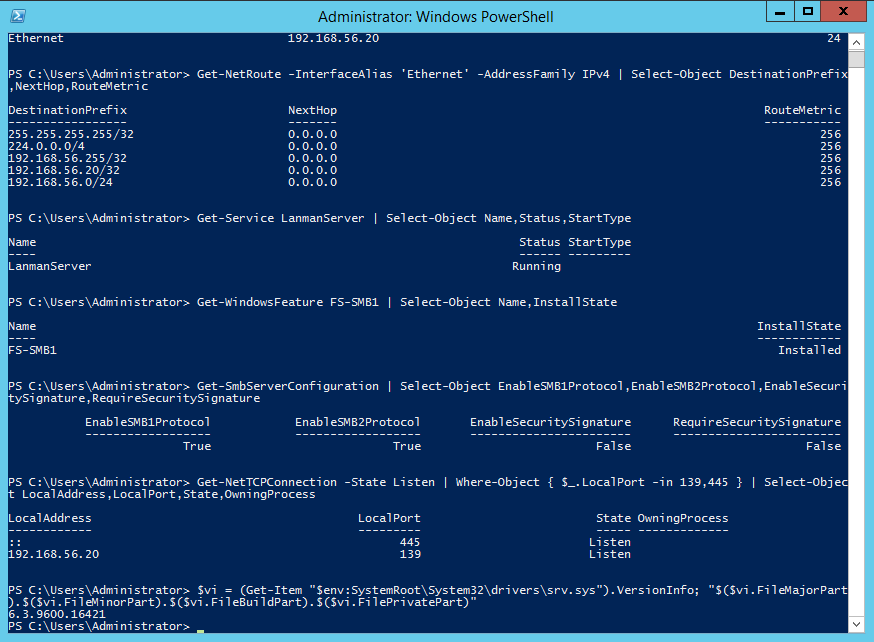
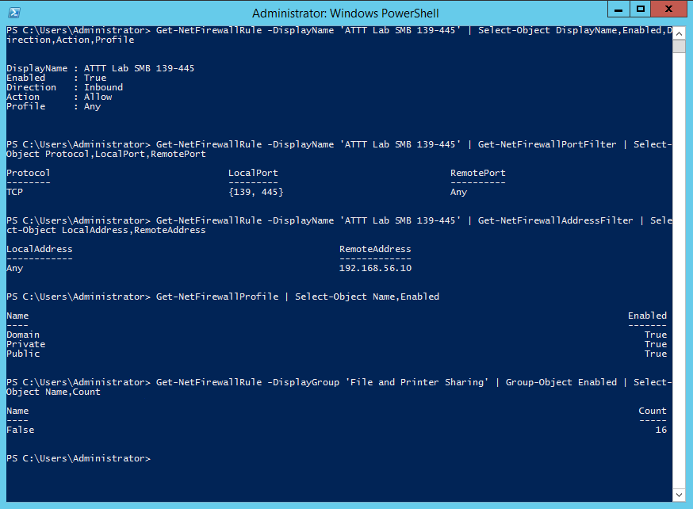
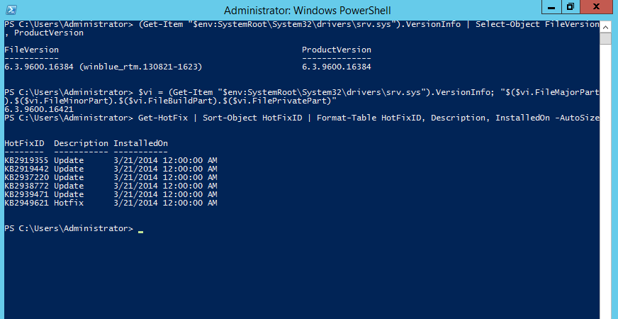

## 3.1. Trạng thái baseline trước đo đạc

Việc xác định và ghi nhận trạng thái ban đầu (baseline) của hệ thống máy chủ mục tiêu trước khi thực hiện các kịch bản thực nghiệm nhằm tạo mốc tham chiếu nhất quán để đối chiếu các phép đo tiếp theo. Mốc xuất phát này ghi nhận các thông số định lượng cụ thể về cấu hình địa chỉ mạng, trạng thái dịch vụ chia sẻ tệp Server Message Block (SMB) và chính sách tường lửa. Thiết lập này cũng xác định mức độ cập nhật bản vá an ninh thực tế trên hệ điều hành Windows Server 2012 R2. Các dữ liệu đo đạc cục bộ thu thập tại thời điểm này đóng vai trò mốc đối chiếu độc lập đối với các tín hiệu phản hồi mạng đo được từ trạm kiểm thử trong các giai đoạn sau.

### 3.1.1. Trạng thái mạng và dịch vụ SMB

Môi trường thực nghiệm được thiết lập trên nền tảng ảo hóa với hai máy ảo chính gồm trạm kiểm thử Kali Linux và máy chủ mục tiêu Windows Server 2012 R2. Cả hai máy ảo đều được cấu hình duy nhất một bộ điều hợp mạng chế độ Host-Only Adapter, không gắn thêm card mạng NAT hay Bridged, qua đó giới hạn đường truyền dữ liệu trong phạm vi phân đoạn mạng thử nghiệm nội bộ. Bảng định tuyến trên trạm Kali Linux ghi nhận dải mạng cục bộ 192.168.56.0/24 qua giao diện eth0 với địa chỉ IP 192.168.56.10/24 và không kích hoạt tuyến đường mặc định (default route). Tương tự, máy chủ Windows Server 2012 R2 được ghi nhận địa chỉ IP 192.168.56.20/24 trên giao diện mạng Ethernet và bảng định tuyến cục bộ không ghi nhận tuyến mặc định.

Trên máy chủ mục tiêu, dịch vụ chia sẻ tệp LanmanServer được ghi nhận ở trạng thái Running với chế độ khởi động tự động (Automatic). Thành phần tính năng FS-SMB1 hiển thị trạng thái đã cài đặt (Installed) trên hệ điều hành. Cấu hình SMB Server ghi nhận hai thuộc tính EnableSMB1Protocol và EnableSMB2Protocol đều mang giá trị True. Đây là trạng thái cấu hình cục bộ; các dialect thực sự quan sát được từ xa được trình bày ở Kịch bản 1. Hai thuộc tính ký số cục bộ EnableSecuritySignature và RequireSecuritySignature được ghi nhận mang giá trị False; kết quả signing quan sát từ xa được trình bày riêng ở Kịch bản 1 và Kịch bản 2. Lệnh kiểm tra kết nối mạng cục bộ xác nhận tiến trình hệ thống (PID 4) đang mở cổng lắng nghe (Listen) trên cổng TCP 445 ứng với địa chỉ :: và cổng TCP 139 ứng với địa chỉ 192.168.56.20.

Bảng 3.1 tổng hợp chi tiết các thông số mạng, dịch vụ chia sẻ tệp và cấu hình tường lửa ghi nhận được trên hai máy ảo tại thời điểm xuất phát.

**Bảng 3.1. Trạng thái mạng, dịch vụ SMB và Windows Firewall trước đo đạc**

| Hạng mục | Giá trị ghi nhận | Ghi chú |
|---|---|---|
| Địa chỉ IP và mạng con Kali Linux | `192.168.56.10/24` (giao diện `eth0`) | Tuyến mạng cục bộ `192.168.56.0/24`, không cấu hình default route |
| Địa chỉ IP và mạng con Windows Server | `192.168.56.20/24` (giao diện `Ethernet`) | Bảng định tuyến cục bộ, không cấu hình default route |
| Cấu hình card mạng VirtualBox | 1 card Host-Only Adapter trên mỗi máy ảo | Cấu hình giới hạn đường truyền trong phân đoạn lab, không cấu hình card NAT hay Bridged |
| Dịch vụ chia sẻ tệp (LanmanServer) | `Running` (chế độ khởi động `Automatic`) | Dịch vụ SMB đang chạy cục bộ trên máy chủ mục tiêu |
| Tính năng Windows FS-SMB1 | `Installed` | Thành phần SMBv1 được cài đặt sẵn trên hệ điều hành |
| Cấu hình giao thức SMB Server | `EnableSMB1Protocol : True` `EnableSMB2Protocol : True` | Cả hai thuộc tính cấu hình cục bộ đều có giá trị True |
| Chính sách ký số gói tin SMB nội bộ | `EnableSecuritySignature : False` `RequireSecuritySignature : False` | Thiết lập ký số cục bộ không bắt buộc |
| Trạng thái lắng nghe cổng cục bộ | TCP 445 (`::`) TCP 139 (`192.168.56.20`) | Tiến trình hệ thống đang lắng nghe cục bộ trên cổng 139 và 445 |
| Trạng thái hồ sơ Windows Firewall | Domain: `True`, Private: `True`, Public: `True` | Cả ba hồ sơ Windows Firewall có Enabled=True |
| Nhóm quy tắc chia sẻ tệp mặc định | 16 quy tắc `File and Printer Sharing` đều `False` | Các quy tắc chia sẻ tệp mặc định đều bị vô hiệu hóa |
| Quy tắc tường lửa tùy biến | Tên: `ATTT Lab SMB 139-445` Action: `Allow`, Direction: `Inbound` Protocol: `TCP`, LocalPort: `{139, 445}` | Quy tắc cho phép có phạm vi RemoteAddress giới hạn duy nhất tại `192.168.56.10` |

Hình 3.1 trình bày kết quả kiểm tra tổng hợp cấu hình mạng, trạng thái dịch vụ chia sẻ tệp và các cổng lắng nghe trên máy chủ Windows Server 2012 R2 thông qua giao diện Windows PowerShell trước thực nghiệm.

Các dữ liệu hiển thị trên Hình 3.1 xác thực cấu hình mạng của giao diện Ethernet với địa chỉ 192.168.56.20/24, trạng thái dịch vụ LanmanServer, việc cài đặt tính năng FS-SMB1 và các socket 139/445 đang ở trạng thái Listen trên máy chủ. Trạng thái lắng nghe cục bộ không tự xác định trạng thái cổng nhìn từ trạm Kali; khả năng tiếp cận từ xa phải được đo riêng qua đường mạng và chính sách lọc hiện hành.

Về cấu hình tường lửa cục bộ, Windows Firewall ghi nhận cả ba hồ sơ mạng Domain, Private và Public đều có thuộc tính Enabled mang giá trị True. Toàn bộ 16 quy tắc mặc định thuộc nhóm File and Printer Sharing hiển thị ở trạng thái vô hiệu hóa (False). Trên máy chủ, một quy tắc tùy biến mang tên ATTT Lab SMB 139-445 được kích hoạt với chiều đi vào (Inbound), hành động cho phép (Allow), giao thức TCP trên hai cổng cục bộ 139 và 445, cùng phạm vi địa chỉ nguồn từ xa (RemoteAddress) là 192.168.56.10.

Thuộc tính cấu hình của quy tắc tường lửa tùy biến ATTT Lab SMB 139-445 cùng trạng thái các hồ sơ tường lửa trên máy chủ mục tiêu được thể hiện tại Hình 3.2.

Hình 3.2 xác nhận quy tắc tùy biến được cấu hình cho TCP 139/445 với phạm vi địa chỉ nguồn 192.168.56.10, đồng thời nhóm File and Printer Sharing mặc định được ghi nhận ở trạng thái tắt. Đây là trạng thái cấu hình tại baseline; khả năng tiếp cận dịch vụ từ Kali được kiểm tra bằng các phép đo từ xa ở phần tiếp theo.

### 3.1.2. Trạng thái bản vá và mốc phục hồi

Để xác định trạng thái cập nhật liên quan MS17-010, đề tài đối chiếu thông tin phiên bản srv.sys và danh mục hotfix cục bộ với tài liệu Microsoft. Truy vấn tệp srv.sys tại đường dẫn C:\Windows\System32\drivers\srv.sys ghi nhận chuỗi FileVersion hiển thị là 6.3.9600.16384 (winblue_rtm.130821-1623).

Để thu được giá trị phiên bản số nhị phân, quy trình kiểm tra thực hiện ghép nối bốn trường FileMajorPart, FileMinorPart, FileBuildPart và FilePrivatePart từ tiêu đề tệp driver, xác định phiên bản số thực tế của tệp srv.sys là 6.3.9600.16421. Theo Microsoft Security Bulletin MS17-010 và tài liệu hỗ trợ “How to verify that MS17-010 is installed”, ngưỡng phiên bản đã cập nhật tối thiểu của srv.sys đối với nền tảng Windows Server 2012 R2 là 6.3.9600.18604, tương ứng với việc cài đặt gói cập nhật KB4012213 hoặc KB4012216. Phép so sánh số học cho thấy giá trị phiên bản số của máy chủ mục tiêu thấp hơn ngưỡng phiên bản đã cập nhật tương ứng (6.3.9600.16421 < 6.3.9600.18604).

<!-- CITE-ANCHOR: S005, S032; final IEEE numbering deferred to global normalization gate -->

Song song với việc đối chiếu phiên bản driver, danh mục cập nhật hệ thống được kiểm tra qua lệnh Get-HotFix. Danh mục Get-HotFix quan sát được gồm sáu mục (KB2919355, KB2919442, KB2937220, KB2938772, KB2939471 và KB2949621) có ngày cài đặt 21/03/2014; trong danh mục này không ghi nhận KB4012213, KB4012216 hoặc bản cập nhật thay thế đã được ánh xạ là chứa bản sửa lỗi MS17-010.

Dựa trên phiên bản số nhị phân thấp hơn ngưỡng cập nhật tối thiểu và danh mục hotfix quan sát được, trạng thái bản vá của máy chủ được phân loại là UNPATCHED đối với MS17-010. UNPATCHED là phân loại trạng thái bản vá cục bộ và không tự tạo ra một phán quyết lỗ hổng từ phép đo từ xa.

Snapshot Before Demo được ghi nhận cho cả hai máy ảo ở trạng thái poweroff và được chọn làm mốc phục hồi của thực nghiệm.

Bảng 3.2 tổng hợp các tiêu chí đối chiếu phiên bản driver, danh mục bản vá và mốc phục hồi hệ thống trước khi bắt đầu đo đạc.

**Bảng 3.2. Trạng thái bản vá và mốc phục hồi**

| Hạng mục | Giá trị ghi nhận | Ghi chú / căn cứ đối chiếu ngắn |
|---|---|---|
| Chuỗi phiên bản hiển thị tệp `srv.sys` | `FileVersion: 6.3.9600.16384 (winblue_rtm.130821-1623)` | Chuỗi ký tự thuộc tính hiển thị của tệp driver |
| Phiên bản số nhị phân tệp `srv.sys` | `6.3.9600.16421` | Trích xuất từ 4 trường số FileMajor, FileMinor, FileBuild, FilePrivate |
| Ngưỡng phiên bản cập nhật tối thiểu | `6.3.9600.18604` | Căn cứ tài liệu Microsoft Support (Article 4023262) cho Windows Server 2012 R2 |
| Mã bản vá liên quan khắc phục MS17-010 | `KB4012213` (Security Only) hoặc `KB4012216` (Monthly Rollup) | Các gói cập nhật chính thức áp dụng cho Windows Server 2012 R2 |
| Danh mục bản vá hệ thống ghi nhận | 6 bản vá (KB2919355, KB2919442, KB2937220, KB2938772, KB2939471, KB2949621 cài ngày 21/03/2014) | Trong danh mục quan sát được không ghi nhận KB4012213, KB4012216 hoặc bản cập nhật thay thế đã được ánh xạ là chứa bản sửa lỗi MS17-010 |
| Phân loại trạng thái bản vá cục bộ | **`UNPATCHED`** | Phiên bản số nhị phân thấp hơn ngưỡng cập nhật tối thiểu ($6.3.9600.16421 < 6.3.9600.18604$) và thiếu bản vá tương ứng trong danh mục quan sát được |
| Mốc khôi phục môi trường (Snapshot) | `Before Demo` | Ghi nhận cho cả hai máy ảo ở trạng thái poweroff tại thời điểm xác minh |

Kết quả kiểm tra thuộc tính phiên bản của driver nhân srv.sys kết hợp danh mục các bản vá hệ thống trên máy chủ Windows Server 2012 R2 được trình bày tại Hình 3.3.

Hình 3.3 thể hiện chuỗi phiên bản hiển thị 6.3.9600.16384, kết quả tính toán phiên bản số 6.3.9600.16421 qua các trường nhị phân và danh sách 6 bản cập nhật hệ thống từ năm 2014. Hai nhóm dữ liệu phiên bản và hotfix được dùng cùng với ngưỡng Microsoft để phân loại trạng thái bản vá cục bộ.

Trên cơ sở trạng thái baseline này, Mục 3.2 trình bày các kết quả khảo sát SMB từ trạm Kali Linux.
