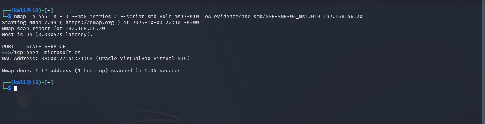

## 3.3. Kết quả Kịch bản 2 — Kiểm tra dấu hiệu MS17-010 bằng NSE

Sau khi hoàn tất quá trình rà quét khám phá mạng và dịch vụ SMB trong Kịch bản 1, Kịch bản 2 tập trung khảo sát các thuộc tính kỹ thuật và thăm dò dấu hiệu liên quan đến lỗ hổng an ninh MS17-010. Tiến trình thực nghiệm được triển khai từ trạm kiểm thử Kali Linux nhắm vào máy chủ mục tiêu Windows Server 2012 R2 qua tập kịch bản chuyên dụng thuộc Nmap Scripting Engine (NSE). Quy trình đo đạc được thiết kế tuần tự nhằm xác định trạng thái tiếp cận cổng, các phương ngữ SMB được ghi nhận, chính sách ký số gói tin, và ghi nhận phản hồi thực tế của kịch bản kiểm tra lỗ hổng chuyên biệt.

### 3.3.1. Khảo sát điều kiện kết nối và thuộc tính giao thức SMB (NSE-SMB-01 đến NSE-SMB-03)

Trước khi kiểm tra dấu hiệu lỗ hổng, ba phép đo thành phần gồm NSE-SMB-01, NSE-SMB-02 và NSE-SMB-03 được thực hiện nhằm xác lập điều kiện tiếp cận cổng, phương ngữ và chính sách ký số của dịch vụ SMB trên hệ thống mục tiêu.

Phép đo NSE-SMB-01 tiến hành quét cổng TCP SYN có ghi nhận nguyên nhân phản hồi (`--reason`) đối với hai cổng dịch vụ tiêu chuẩn là TCP 139 và TCP 445. Từ trạm Kali, TCP 139 và 445 được ghi nhận ở trạng thái OPEN và phản hồi SYN-ACK với giá trị TTL bằng 128. Kết quả này xác nhận máy chủ mục tiêu đang lắng nghe và phản hồi các gói tin khởi tạo kết nối TCP trên cả hai cổng chia sẻ tệp. Tuy nhiên, về mặt an toàn thông tin, trạng thái mở của cổng TCP 445 chỉ phản ánh khả năng tiếp cận dịch vụ qua mạng từ góc nhìn trạm kiểm thử, hoàn toàn không đồng nghĩa với việc hệ thống tồn tại lỗ hổng bảo mật (`445 OPEN != vulnerable`). Trạng thái mở cổng cũng không chứng minh cho việc kết nối phiên SMB tầng ứng dụng thành công hay việc phân quyền truy cập chia sẻ tệp đã sẵn sàng.

Tiếp theo, phép đo NSE-SMB-02 áp dụng kịch bản `smb-protocols` trên cổng 445. Kịch bản `smb-protocols` ghi nhận 5 phương ngữ: `NT LM 0.12 (SMBv1)`, `2.0.2`, `2.1`, `3.0` và `3.0.2`. Trong đầu ra ghi nhận của Nmap, phương ngữ `NT LM 0.12` đi kèm chú thích nguyên văn `[dangerous, but default]`; đây là annotation mặc định của công cụ quét, không phải là kết luận hay phán quyết về lỗ hổng. Về mặt phương pháp luận, sự hiện diện của phương ngữ SMBv1 trong kết quả đo không đồng nghĩa với việc máy chủ đã được xác nhận dính lỗ hổng MS17-010 (`SMBv1 enabled != MS17-010 confirmed`).

Phép đo NSE-SMB-03 sử dụng kịch bản `smb2-security-mode` trên cổng 445. Trên phương ngữ 3.0.2 được ghi nhận, kịch bản trả về kết quả `Message signing enabled but not required`. Đây là quan sát thăm dò từ xa của kịch bản Nmap trên phương ngữ cụ thể này và được duy trì độc lập với các cờ cấu hình nội bộ tại Mục 3.1. Kết quả này không được khái quát hóa cho các phương ngữ khác và không dùng để đối chiếu hay hòa giải trực tiếp với thiết lập trong hệ điều hành.

Bảng 3.4 tổng hợp trình tự, mục tiêu kỹ thuật, kết quả quan sát trực tiếp và ranh giới phân loại của bốn phép đo NSE được thực hiện trong Kịch bản 2.

**Bảng 3.4. Trình tự và kết quả các phép đo NSE trên dịch vụ SMB từ trạm Kali Linux**

| Phép đo | Mục tiêu kỹ thuật | Kết quả ghi nhận trực tiếp | Phân loại & Ranh giới kết luận |
|---|---|---|---|
| **NSE-SMB-01** | Kiểm tra trạng thái và phản hồi tầng giao vận của các cổng dịch vụ SMB | Cổng `139/tcp` và `445/tcp` ở trạng thái `OPEN`; phản hồi `syn-ack`, giá trị TTL bằng 128 | **Cổng dịch vụ mở (Open Ports)** Từ trạm Kali, TCP 139 và 445 được ghi nhận ở trạng thái OPEN và phản hồi SYN-ACK. Trạng thái cổng mở phản ánh khả năng tiếp cận dịch vụ qua mạng, không đồng nghĩa với việc tồn tại lỗ hổng an ninh (`445 OPEN != vulnerable`). |
| **NSE-SMB-02** | Khảo sát các phương ngữ SMB được ghi nhận từ xa | Kịch bản `smb-protocols` ghi nhận 5 phương ngữ: • `NT LM 0.12 (SMBv1)` • `2.0.2`, `2.1` • `3.0`, `3.0.2` Chú thích `[dangerous, but default]` là đầu ra nguyên văn của công cụ | **Các phương ngữ SMB được ghi nhận** Kịch bản ghi nhận 5 phương ngữ, bao gồm phương ngữ kế thừa SMBv1 cùng các phương ngữ SMB2/3. Sự hiện diện của phương ngữ SMBv1 không đồng nghĩa với việc xác nhận máy chủ tồn tại lỗ hổng MS17-010 (`SMBv1 enabled != MS17-010 confirmed`). |
| **NSE-SMB-03** | Khảo sát cấu hình bảo mật và chính sách ký số gói tin SMB từ xa | Kịch bản `smb2-security-mode` (trên phương ngữ 3.0.2) ghi nhận: • Ký số thông điệp: `enabled but not required` | **Ký số không bắt buộc (Signing Not Required)** Chính sách ký số gói tin SMB từ xa ở trạng thái kích hoạt nhưng không bắt buộc đối với phương ngữ kiểm tra. Kết quả quan sát từ xa độc lập với các cờ cấu hình cục bộ và không khái quát hóa cho toàn bộ phương ngữ. |
| **NSE-SMB-04** | Kiểm tra dấu hiệu lỗ hổng an ninh MS17-010 bằng kịch bản chuyên dụng | Cổng 445/tcp mở; kết quả quét ghi nhận thông báo `Nmap done`; không xuất hiện khối kết quả `Host script results:`; không có thông báo lỗi hiển thị trong đầu ra ghi nhận | **Không xác định (UNKNOWN / NO USABLE SCRIPT RESULT)** Kịch bản quét không sinh ra phán quyết an ninh khả dụng. Phân loại UNKNOWN là phân loại phương pháp luận của đề án, không phải chuỗi ký tự nguyên văn của Nmap. Kết quả này chỉ cho phép phân loại là chưa xác định trong phạm vi phép đo; nguyên nhân của việc không có đầu ra script khả dụng không được xác lập. UNKNOWN != SAFE. |

### 3.3.2. Đánh giá dấu hiệu lỗ hổng MS17-010 và đối chiếu trạng thái bản vá (NSE-SMB-04)

Sau khi ghi nhận các thuộc tính về cổng, phương ngữ và chính sách ký số, phép đo NSE-SMB-04 được thực hiện bằng lệnh Nmap có tùy chọn `--script smb-vuln-ms17-010` nhắm vào TCP 445 của `192.168.56.20`.

Kết quả thực thi dòng lệnh và các thông tin ghi nhận trên màn hình terminal của trạm kiểm thử Kali Linux được thể hiện tại Hình 3.6.

Quan sát trực tiếp Hình 3.6 cho thấy lệnh Nmap được thực thi với tùy chọn `--script smb-vuln-ms17-010` nhắm vào cổng 445 của địa chỉ IP mục tiêu `192.168.56.20`. Kết quả ghi nhận máy chủ mục tiêu trực tuyến (`Host is up`), cổng 445/tcp mở (`open microsoft-ds`), và địa chỉ MAC của card mạng ảo VirtualBox. Đầu ra ghi nhận đạt đến dòng thông báo hoàn tất `Nmap done`, dấu nhắc shell xuất hiện sau đó, và không có thông báo lỗi hiển thị trong đầu ra ghi nhận. Trong toàn bộ kết quả, không xuất hiện khối `Host script results:`.

Việc không xuất hiện khối kết quả kịch bản trên cổng 445 mở đặt ra yêu cầu phân định giữa quan sát trực tiếp và phân loại kỹ thuật. Trong khuôn khổ đề án, kết quả của phép đo NSE-SMB-04 được phân loại là **`UNKNOWN / NO USABLE SCRIPT RESULT`** (Không xác định / Không có kết quả kịch bản khả dụng). Cần nhấn mạnh rằng `UNKNOWN` là phân loại phương pháp luận của đề án, không phải chuỗi ký tự nguyên văn do Nmap in ra màn hình. Nguyên nhân của việc không có đầu ra script khả dụng không được xác lập từ bộ bằng chứng hiện có. Do đó, người thực nghiệm không đưa ra các giả định chủ quan về mã lỗi hay cơ chế xử lý gói tin.

Từ kết quả phân loại trên, nguyên tắc an toàn thông tin cốt lõi được xác lập là: **`UNKNOWN != SAFE`**. Việc một kịch bản rà quét từ xa không đưa ra phán quyết lỗ hổng hoàn toàn không đồng nghĩa với việc máy chủ mục tiêu an toàn, miễn nhiễm hoặc đã được cập nhật bản vá khắc phục MS17-010. Sự vắng mặt của cảnh báo lỗ hổng không thể bị đánh đồng với sự an toàn của hệ thống, và kết quả này không thể tự suy diễn thành các trạng thái như `VULNERABLE`, `SAFE`, `NOT VULNERABLE` hay `PATCHED`.

Để có cái nhìn toàn diện, kết quả thăm dò từ xa được đối chiếu với hiện trạng cấu hình của máy chủ mục tiêu. Mục 3.1 đã phân loại trạng thái bản vá cục bộ là UNPATCHED; dữ kiện này được giữ độc lập với kết quả NSE từ xa. Thực nghiệm xác lập hai trục thông tin riêng biệt: trục khảo sát cấu hình nội bộ ghi nhận trạng thái `UNPATCHED`, trong khi trục thăm dò từ xa của phép đo NSE-SMB-04 ghi nhận kết quả `UNKNOWN / NO USABLE SCRIPT RESULT`. Hai trục thông tin này phản ánh hai góc độ tiếp cận khác nhau và không dùng dữ kiện của trục này để suy diễn thay thế cho trục kia. Mốc cấu hình cục bộ `UNPATCHED` không tự biến kết quả đo đạc từ xa thành có lỗ hổng (`VULNERABLE`). Ngược lại, kết quả chưa xác định từ xa `UNKNOWN` không thể phủ định hiện trạng thiếu bản vá của hệ thống để coi máy chủ là an toàn hay đã vá lỗi. Sự khác biệt giữa hai trục quan sát phản ánh khoảng cách giữa kiểm tra cấu hình nội bộ và thăm dò động từ xa qua mạng, và không tự suy đoán kết quả đo là sai lệch khi chưa có bằng chứng thực nghiệm bổ sung.

Về ranh giới phạm vi, Kịch bản 2 dừng ở phạm vi rà quét NSE; không có bước khai thác hoặc kết quả thực thi mã từ xa được ghi nhận trong kịch bản này.

Sau khi hoàn tất trạng thái baseline cùng hai kịch bản đo đạc ban đầu (khảo sát bề mặt dịch vụ SMB tại Kịch bản 1 và kiểm tra dấu hiệu MS17-010 bằng NSE tại Kịch bản 2), nghiên cứu chuyển tiếp sang pha thực nghiệm can thiệp có kiểm soát (Case B). Bước thực nghiệm tiếp theo thay đổi một biến số duy nhất: cấu hình vô hiệu hóa giao thức SMBv1 trên máy chủ Windows Server 2012 R2. Sau đó, các phép đo được chọn (gồm phép đo kiểm tra phương ngữ và phép đo kiểm tra kịch bản MS17-010) được lặp lại nhằm đối chiếu sự thay đổi về danh mục phương ngữ và phản hồi từ xa từ góc nhìn trạm kiểm thử.
