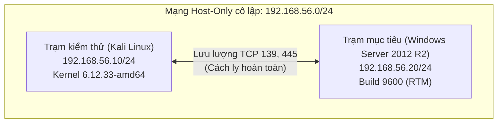
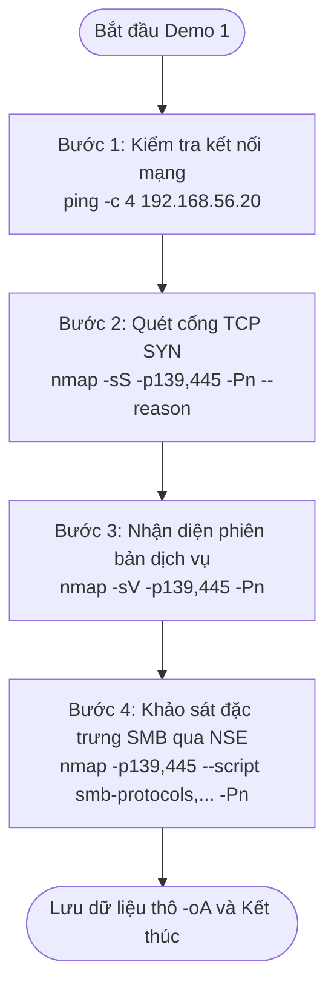

# CHƯƠNG 2. XÂY DỰNG MÔ HÌNH THỰC NGHIỆM VÀ KỊCH BẢN DEMO

Chương 2 trình bày thiết kế, cài đặt môi trường mạng thực nghiệm cô lập và chuẩn hóa các kịch bản demo khảo sát an toàn dịch vụ SMB cùng lỗ hổng MS17-010.

Nội dung trọng tâm gồm cấu hình trạm kiểm thử Kali Linux và máy mục tiêu Windows Server 2012 R2. Đồ án xây dựng hai kịch bản demo rà quét bằng Nmap và NSE, thiết lập quy trình kiểm thử vi sai cho các biện pháp giảm thiểu (vô hiệu hóa SMBv1 và tường lửa pfSense), đồng thời chuẩn hóa dữ liệu thu thập phục vụ Chương 3.

## 2.1. Mô hình thực nghiệm

### 2.1.1. Mục tiêu của mô hình
Mô hình thực nghiệm được xây dựng nhằm cung cấp không gian kiểm thử an toàn, độc lập và có thể tái lập [1]. Mục tiêu chính gồm:
1. **Khảo sát bề mặt dịch vụ:** Đánh giá cấu hình SMB, nhận diện cổng TCP 139, 445 và phân loại phiên bản giao thức đang chạy.
2. **Thăm dò dấu hiệu an ninh:** Kiểm tra chỉ dấu liên quan đến lỗ hổng MS17-010 qua các gói tin thăm dò chuẩn hóa của NSE mà không gây gián đoạn hệ thống.
3. **Đo đạc hiệu quả giảm thiểu:** So sánh sự thay đổi trạng thái mạng và kết quả quét trước và sau can thiệp phòng thủ.
4. **Bảo đảm an toàn kiểm thử:** Cách ly hoàn toàn lưu lượng trong môi trường lab nội bộ, ngăn chặn rò rỉ gói tin ra mạng bên ngoài.

### 2.1.2. Sơ đồ và thành phần của mô hình
Mô hình gồm trạm kiểm thử Kali Linux và trạm mục tiêu Windows Server 2012 R2, kết nối trực tiếp qua mạng Host-Only ảo hóa.



Hình 2.1. Sơ đồ topo kết nối mạng thực nghiệm trên VirtualBox

Cả hai máy ảo cùng thuộc dải mạng `192.168.56.0/24`. Trong kịch bản mở rộng ở Mục 2.5.3, máy ảo tường lửa pfSense được tích hợp ở giữa theo mô hình cầu nối trong suốt (Transparent Bridge) để lọc gói mà không thay đổi địa chỉ IP hai đầu.

### 2.1.3. Thông số môi trường thực nghiệm
Thông số phần cứng, hệ điều hành và cấu hình mạng được tổng hợp trong Bảng 2.1.

Bảng 2.1. Thông số kỹ thuật của các máy ảo trong môi trường thực nghiệm

| Thông số | Trạm kiểm thử (Kali Linux) | Trạm mục tiêu (Windows Server) | Ý nghĩa thiết kế |
| :--- | :--- | :--- | :--- |
| **Hệ điều hành** | Kali Linux (Kernel 6.12.33-amd64) [2] | Windows Server 2012 R2 Eval | Môi trường chuẩn hóa |
| **Bản dựng** | Kali Rolling (Nmap 7.99) | Build 9600 (RTM nguyên bản) | Tái hiện máy chưa vá |
| **Phần cứng ảo** | 2 vCPU, 4096 MB RAM | 2 vCPU, 4096 MB RAM | Đồng nhất tài nguyên |
| **IP / Subnet** | `192.168.56.10/24` (Tĩnh) | `192.168.56.20/24` (Tĩnh) | Cố định địa chỉ mạng |
| **Giao diện mạng**| 1 Host-Only NIC (`eth0`) | 1 Host-Only NIC (`Ethernet`) | Cách ly, không Internet |
| **Cổng dịch vụ** | Cổng nguồn ngẫu nhiên | TCP 139 và TCP 445 [3] | Khảo sát socket SMB |
| **Dịch vụ SMB** | Máy khách gửi yêu cầu | LanmanServer: `Running` | Dịch vụ chia sẻ tệp |
| **Tường lửa** | Cho phép gửi gói ra lab | Mở TCP 139, 445 từ `.10` | Ủy quyền trạm quét |

Việc chuẩn hóa phần cứng và địa chỉ IP tĩnh giúp loại bỏ yếu tố gây nhiễu, bảo đảm tính nhất quán cho các phép đo.

## 2.2. Cài đặt và cấu hình môi trường

### 2.2.1. Cấu hình mạng Host-Only trên VirtualBox
Môi trường thực nghiệm được triển khai trên Oracle VM VirtualBox 7.2.20 r170876:
- **Tạo giao diện mạng:** Khởi tạo card mạng Host-Only với dải địa chỉ IPv4 `192.168.56.0/24`, địa chỉ adapter máy chủ là `192.168.56.1/24`.
- **Vô hiệu hóa DHCP:** Tắt hoàn toàn VirtualBox DHCP Server để ngăn cấp phát IP động, bảo đảm tính cố định cho cấu hình tĩnh.
- **Cách ly mạng:** Không dùng card mạng NAT hay Bridged, không đặt Default Gateway nhằm ngăn lưu lượng thoát ra ngoài môi trường lab.

### 2.2.2. Cấu hình máy Kali Linux
Trạm kiểm thử sử dụng Kali Linux 64-bit (Kernel 6.12.33-amd64) [2]:
- **Cấu hình mạng:** Thiết lập địa chỉ IPv4 tĩnh `192.168.56.10/24` trên giao diện `eth0`.
- **Công cụ rà quét:** Sử dụng Nmap 7.99 cùng bộ thư viện kịch bản NSE chuẩn hóa.
- **Công cụ phân tích:** Cài đặt `tcpdump` và `tshark` phục vụ bắt và phân tích gói tin mạng tại tầng giao vận.

### 2.2.3. Cấu hình máy Windows Server 2012 R2
Trạm mục tiêu sử dụng Windows Server 2012 R2 Standard Evaluation 64-bit:
- **Cấu hình mạng:** Gán địa chỉ tĩnh `192.168.56.20/24` trên giao diện `Ethernet`.
- **Trạng thái hệ thống:** Giữ nguyên bản dựng Build 9600 (RTM), không cài đặt bất kỳ gói rollup nào để làm hệ thống đối chứng trước khi áp dụng các biện pháp an ninh.

### 2.2.4. Cấu hình SMB và Windows Firewall
Dịch vụ chia sẻ tệp và tường lửa trên trạm mục tiêu được cấu hình qua PowerShell:
- **Kích hoạt dịch vụ:** Dịch vụ SMB (`LanmanServer`) đặt chế độ khởi động tự động (`Automatic`) và đang chạy (`Running`). Dịch vụ lắng nghe trên TCP 445 (Direct-hosted SMB) và TCP 139 (NetBIOS Session Service qua TCP/IP) [3].
- **Trạng thái giao thức:** Cả SMBv1 và SMBv2 đều được bật (`EnableSMB1Protocol = True`, `EnableSMB2Protocol = True`), tính năng hệ thống `FS-SMB1` được cài đặt đầy đủ.
- **Tường lửa:** Windows Firewall bật (`Enabled`), tạo luật Inbound cho phép TCP 139 và TCP 445 từ `192.168.56.10`, chặn toàn bộ truy cập ngoài phạm vi kiểm thử.

### 2.2.5. Kiểm tra bản vá MS17-010 và tạo snapshot
Trước khi thực hiện demo, hiện trạng an ninh trạm mục tiêu được kiểm tra nghiêm ngặt:
- **Kiểm tra bản vá:** Lệnh `Get-HotFix` trên PowerShell xác nhận hệ thống hoàn toàn vắng mặt hai bản vá tích lũy KB4012213 và KB4012216 [4].
- **Xác thực driver nhân:** Phiên bản driver `srv.sys` tại `C:\Windows\System32\drivers\srv.sys` đạt `6.3.9600.16421`, thấp hơn ngưỡng an toàn `6.3.9600.18604` [5], xác nhận hệ thống ở trạng thái chưa vá (`UNPATCHED`).
- **Tạo snapshot:** Thiết lập điểm khôi phục `Before Demo` trên cả hai máy ảo VirtualBox để bảo đảm khả năng phục hồi nguyên trạng sau mỗi phiên can thiệp.

## 2.3. Kịch bản Demo 1 — Khảo sát dịch vụ SMB bằng Nmap

### 2.3.1. Mục tiêu và phạm vi
Kịch bản Demo 1 tập trung khảo sát bề mặt dịch vụ SMB từ góc độ người đánh giá an ninh:
- **Mục tiêu:** Xác định trạng thái socket trên cổng TCP 139 và TCP 445, nhận diện phiên bản dịch vụ và các dialect SMB được máy chủ hỗ trợ.
- **Phạm vi:** Giới hạn trong các kỹ thuật quét phi xâm nhập, không gửi payload khai thác hay gây gián đoạn máy mục tiêu.

### 2.3.2. Quy trình và các lệnh thực hiện
Quy trình khảo sát của Demo 1 gồm 4 bước kỹ thuật trên Kali Linux:



- **Bước 1: Kiểm tra thông tuyến mạng:**
```bash
ping -c 4 192.168.56.20
```
- **Bước 2: Quét trạng thái cổng TCP 139 và 445** bằng kỹ thuật TCP SYN [6]:
```bash
nmap -sS -p139,445 -Pn --reason -oA demo1_step2_smb_ports 192.168.56.20
```
- **Bước 3: Nhận diện dịch vụ và phiên bản:**
```bash
nmap -sV -p139,445 -Pn -oA demo1_step3_smb_version 192.168.56.20
```
- **Bước 4: Khảo sát đặc trưng giao thức qua kịch bản NSE an toàn** (`smb-protocols` [7], `smb-os-discovery`, `smb2-security-mode` [8], `smb2-capabilities`):
```bash
nmap -p139,445 --script smb-protocols,smb-os-discovery,smb2-security-mode,smb2-capabilities \
    -Pn -oA demo1_step4_smb_nse 192.168.56.20
```

Các tham số chính gồm: `-sS` (quét TCP SYN nửa mở), `-sV` (nhận diện phiên bản), `-p139,445` (chỉ định cổng SMB), `-Pn` (bỏ qua ping ICMP), `--reason` (hiển thị cờ phản hồi `syn-ack`), `--script` (gọi kịch bản NSE) và `-oA` (xuất 3 định dạng `.nmap`, `.xml`, `.gnmap`).

### 2.3.3. Nội dung cần quan sát và giới hạn kết luận
Trong quá trình thực hiện Demo 1, người thực nghiệm ghi nhận các trường thông tin:
1. **Trạng thái cổng:** Ghi nhận cờ phản hồi tại trường `REASON` (gói `syn-ack` khẳng định socket mở).
2. **Tên dịch vụ:** Đối soát chuỗi dịch vụ (`microsoft-ds` trên cổng 445 hoặc `netbios-ssn` trên cổng 139).
3. **Danh sách dialect SMB:** Kiểm tra sự hiện diện của `NT LM 0.12` (SMBv1) cùng các dialect SMBv2/v3.
4. **Cấu hình ký số:** Kiểm tra cờ `message_signing` (bắt buộc hay tùy chọn).

*Ranh giới kết luận:* Cổng mở và sự hiện diện của SMBv1 chỉ xác nhận bề mặt dịch vụ đang chạy, hoàn toàn không đồng nghĩa hệ thống đã bị tổn thương (`open != vulnerable`). Kết luận an ninh cần tiếp tục được kiểm chứng ở các bước tiếp theo.

## 2.4. Kịch bản Demo 2 — Kiểm tra dấu hiệu MS17-010 bằng NSE

### 2.4.1. Mục tiêu và điều kiện ban đầu
Kịch bản Demo 2 mở rộng đánh giá an ninh bằng kịch bản NSE để nhận diện dấu hiệu của lỗ hổng MS17-010:
- **Mục tiêu:** Thăm dò phản ứng của máy chủ SMB trước gói tin nghiệp vụ chuẩn hóa, đối chiếu trạng thái để xác định nguy cơ mà không làm gián đoạn máy chủ.
- **Điều kiện ban đầu:** Hoàn thành Demo 1, xác nhận hai cổng TCP 139 và 445 đang mở, dịch vụ SMB phản hồi và máy ảo đã lưu mốc snapshot `Before Demo`.

### 2.4.2. Quy trình kiểm tra NSE-SMB-01 đến NSE-SMB-04
Quy trình Demo 2 chuẩn hóa thành 4 phép đo từ `NSE-SMB-01` đến `NSE-SMB-04`:
1. `NSE-SMB-01`: Quét kiểm tra trạng thái cổng TCP 139 và 445 để xác nhận kênh truyền sẵn sàng.
2. `NSE-SMB-02`: Chạy `smb-protocols` kiểm chứng sự hiện diện của dialect SMBv1 (`NT LM 0.12`).
3. `NSE-SMB-03`: Chạy `smb2-security-mode` xác định trạng thái ký số gói tin SMB.
4. `NSE-SMB-04`: Chạy kịch bản chuyên dụng `smb-vuln-ms17-010` để thăm dò dấu hiệu lỗ hổng:
```bash
nmap -p445 --script smb-vuln-ms17-010 --script-args unsafe=0 -Pn -oA demo2_ms17010 192.168.56.20
```

Về cơ chế, kịch bản `smb-vuln-ms17-010` kết nối pipe `IPC$`, gửi gói tin giao dịch SMB tới FID 0 và phân tích mã lỗi trả về [9]. Nếu máy chưa vá, nó phản hồi mã đặc trưng `STATUS_INSUFF_SERVER_RESOURCES` (hoặc `STATUS_INVALID_HANDLE`), qua đó Nmap gắn cờ `VULNERABLE`. Tham số `--script-args unsafe=0` bảo đảm dừng lại ở mức thăm dò an toàn, không kích hoạt khai thác bộ nhớ.

### 2.4.3. Đối chiếu với trạng thái bản vá và giới hạn kết luận
Quy trình đánh giá thiết lập nguyên tắc đối chiếu trên hai trục thông tin độc lập:
1. **Trục tín hiệu từ xa (Remote Signal):** Kết quả phân loại NSE gồm: `VULNERABLE` (có dấu hiệu), `NOT VULNERABLE` (không có dấu hiệu) hoặc `UNKNOWN / NO USABLE SCRIPT RESULT` (không đủ bằng chứng).
2. **Trục trạng thái nội bộ (Local Ground Truth):** Kiểm tra trực tiếp trên Windows Server qua phiên bản driver `srv.sys` và danh sách hotfix từ `Get-HotFix`.

Sự kết hợp giữa hai trục được phân loại thành 4 kịch bản đối chiếu:
- *Khớp chính xác (True Positive):* Nmap báo `VULNERABLE` và máy mục tiêu chưa vá (`UNPATCHED`).
- *Âm tính thực tế (True Negative):* Nmap báo `NOT VULNERABLE` và máy đã cập nhật bản vá.
- *Thiếu hụt dữ liệu:* Kết quả `UNKNOWN` từ xa không đồng nghĩa máy an toàn, cần kiểm tra nội bộ (`UNKNOWN != SAFE`).
- *Sai lệch cảnh báo:* Trường hợp có can thiệp của tường lửa làm thay đổi gói phản hồi.

## 2.5. Kiểm thử các biện pháp giảm thiểu

### 2.5.1. Nguyên tắc kiểm thử trước và sau can thiệp
Để đánh giá hiệu quả phòng thủ, đồ án áp dụng phương pháp kiểm thử vi sai theo nguyên tắc trước và sau can thiệp (before-after test).

Quy trình tuân thủ 3 nguyên tắc:
1. **Tính đơn biến:** Chỉ áp dụng một biện pháp can thiệp tại mỗi ca; giữ nguyên phần cứng, hệ điều hành và dải IP.
2. **Quy chuẩn bộ phép đo:** Sử dụng cùng một tập hợp lệnh Nmap và kịch bản NSE (`NSE-SMB-01` đến `NSE-SMB-04`).
3. **Cô lập trạng thái:** Sau mỗi ca thử nghiệm, phục hồi máy ảo về snapshot `Before Demo` trước khi tiến hành ca tiếp theo.

Bảng 2.2. Ma trận kiểm thử vi sai các giải pháp an toàn dịch vụ SMB

| Trường hợp | Tên giải pháp | Tầng tác động | Mục tiêu can thiệp | Kết quả kỳ vọng |
| :--- | :--- | :--- | :--- | :--- |
| **Baseline** | Chưa can thiệp | Không | Giữ nguyên hiện trạng RTM | Cổng mở, lộ SMBv1, phát hiện MS17-010 |
| **Case B** | Vô hiệu hóa SMBv1 | Tầng dịch vụ OS | Tắt giao thức kế thừa SMBv1 [10] | Cổng mở, loại bỏ SMBv1, triệt tiêu MS17-010 |
| **Case C** | Tường lửa pfSense Bridge | Tầng mạng (L2/L3) | Chặn cổng TCP 139, 445 [11] | Cổng chuyển `filtered`, chặn thăm dò |
| **Case A** | Cập nhật bản vá KB4012213 | Tầng nhân OS (Driver) | Sửa lỗi driver `srv.sys` [4], [5] | Cổng mở, duy trì dịch vụ, máy an toàn |

### 2.5.2. Case B — Vô hiệu hóa SMBv1
Biện pháp giảm thiểu thứ nhất (Case B) là làm cứng giao thức (Protocol Hardening) ở tầng ứng dụng theo khuyến nghị của Microsoft [10], nhằm vô hiệu hóa SMBv1 và duy trì chia sẻ tệp qua SMBv2/SMBv3.

- **Thao tác can thiệp:** Trên Windows Server 2012 R2, mở PowerShell Administrator và chạy:
```powershell
Set-SmbServerConfiguration -EnableSMB1Protocol $false -Force
Restart-Computer -Force
```
- **Xác thực cấu hình:** Sau khi khởi động lại, kiểm tra trạng thái bằng lệnh:
```powershell
Get-SmbServerConfiguration | Select-Object EnableSMB1Protocol, EnableSMB2Protocol
```
- **Kiểm thử vi sai:** Thực thi lại bộ lệnh `NSE-SMB-01` đến `NSE-SMB-04` từ Kali Linux để đối chiếu cấu trúc dialect và cờ phản hồi của NSE.
- **Ranh giới an ninh:** Vô hiệu hóa SMBv1 chỉ loại bỏ bề mặt tấn công của giao thức cũ, hoàn toàn không đồng nghĩa nhân hệ điều hành đã được vá lỗi (`SMBv1 disabled != PATCHED`). Phiên bản driver `srv.sys` vẫn giữ nguyên trạng thái cũ.

### 2.5.3. Case C — Kiểm soát TCP 139/445 bằng pfSense
Biện pháp giảm thiểu thứ hai (Case C) đại diện cho giải pháp kiểm soát truy cập và phân đoạn mạng bằng tường lửa chuyên dụng theo chuẩn NIST SP 800-41 Rev. 1 [11].

- **Mô hình triển khai:** Máy ảo pfSense 2.7.2 được chèn giữa Kali Linux và Windows Server theo kiến trúc cầu nối trong suốt (Transparent Bridge) ở tầng L2. Cấu hình này cho phép lọc gói tin mà không làm thay đổi dải IP `192.168.56.0/24` của hai đầu cuối.
- **Cấu hình thông số nhân:** Trên pfSense, các tham số hệ thống (`System Tunables`) bắt buộc thiết lập:
  - `net.link.bridge.pfil_member = 1`: Bật lọc gói trên giao diện thành viên bridge.
  - `net.link.bridge.pfil_bridge = 0`: Tắt lọc gói trên giao diện bridge tổng để tránh trùng lặp.
  - `net.link.bridge.pfil_onlyip = 1`: Chỉ cho phép lưu lượng IP đi qua cầu nối.
- **Luật kiểm soát:** Thiết lập luật chặn (`Block`) lưu lượng TCP 139 và TCP 445 đến `192.168.56.20`, đồng thời kích hoạt ghi nhật ký (`Log packets`).
- **Kiểm thử vi sai:** Thực hiện lại bộ lệnh Nmap từ Kali Linux để ghi nhận sự chuyển dịch trạng thái cổng sang `filtered`.
- **Ranh giới an ninh:** Trạng thái `filtered` do tường lửa tạo ra chỉ chứng minh lưu lượng bị chặn trên đường truyền, hoàn toàn không đại diện cho trạng thái bản vá của máy chủ nội bộ (`FILTERED != PATCHED`).

### 2.5.4. Vai trò của cập nhật bản vá
Nghiên cứu phân tích vai trò nền tảng của bản vá an ninh chính thức từ Microsoft (Case A đóng vai trò đối chứng lý thuyết).

Bản cập nhật MS17-010 (KB4012213) là giải pháp duy nhất tác động trực tiếp vào căn nguyên lỗi trong nhân hệ điều hành [4], [5]. Bản vá sửa đổi logic xử lý bộ nhớ trong driver `srv.sys`, nâng phiên bản driver từ `6.3.9600.16421` lên `6.3.9600.18604` hoặc cao hơn, loại bỏ hoàn toàn lỗ hổng tràn bộ đệm số nguyên.

So sánh giữa ba giải pháp cho thấy:
1. **Case A (Vá lỗi):** Loại bỏ lỗ hổng tại gốc, bảo đảm dịch vụ hoạt động an toàn, nhưng cần thời gian kiểm thử tương thích và khởi động lại hệ thống.
2. **Case B (Tắt SMBv1):** Triệt tiêu bề mặt tấn công của MS17-010 nhanh chóng, nhưng có thể gây gián đoạn ứng dụng cũ phụ thuộc SMBv1 và không sửa mã nhị phân driver.
3. **Case C (Tường lửa):** Ngăn chặn tiếp cận từ xa tức thời, nhưng không bảo vệ được trước nguy cơ nội bộ cùng phân đoạn mạng.

## 2.6. Thu thập dữ liệu phục vụ đánh giá

### 2.6.1. Log và ảnh chụp thực nghiệm
Để phục vụ phân tích chi tiết và bảo đảm tính minh chứng khoa học ở Chương 3, dữ liệu thực nghiệm được lưu trữ theo các định dạng chuẩn:

1. **Tập tin nhật ký Nmap (`-oA`):** Mọi lệnh quét bắt buộc dùng tham số `-oA <filename>` để xuất ra 3 định dạng đồng thời:
   - Tệp văn bản chuẩn (`.nmap`): Kết quả bảng trực quan, dễ đọc và trích dẫn.
   - Tệp máy đọc (`.xml`): Lưu trữ cấu trúc chi tiết, phục vụ trích xuất tự động qua script.
   - Tệp Grep (`.gnmap`): Hỗ trợ lọc nhanh theo dòng lệnh.
2. **Nhật ký bắt gói mạng (`.pcap`):** Sử dụng `tcpdump` hoặc `tshark` trên Kali Linux ghi lại lưu lượng trên `eth0`, làm cơ sở phân tích bắt tay TCP và gói tin SMB ở mức byte.
3. **Nhật ký hệ thống và ảnh chụp:** Ghi nhận nhật ký Event Viewer trên Windows Server, nhật ký tường lửa pfSense và lưu trữ ảnh chụp màn hình terminal kèm dấu thời gian và lệnh thực thi rõ ràng.

### 2.6.2. Nguyên tắc diễn giải kết quả
Quá trình diễn giải dữ liệu thực nghiệm ở Chương 3 bắt buộc tuân thủ 6 nguyên tắc suy luận an toàn:

1. **Cổng mở không đồng nghĩa có lỗ hổng (`open != vulnerable`):** Cổng TCP 139/445 mở chỉ xác nhận socket đang lắng nghe, chưa đủ căn cứ kết luận máy chủ có điểm yếu an ninh.
2. **Bật SMBv1 không đồng nghĩa khai thác được (`SMBv1 enabled != exploit confirmed`):** Sự tồn tại của SMBv1 chỉ là điều kiện cần; nguy cơ bị tổn thương phụ thuộc vào việc nhân hệ điều hành đã được vá lỗi hay chưa.
3. **Kết quả kịch bản không xác định không đồng nghĩa an toàn (`UNKNOWN != SAFE`):** Khi Nmap không trả về kết quả khẳng định do cơ chế mạng, hệ thống không thể tự động được coi là an toàn.
4. **Cổng bị lọc không đồng nghĩa đã vá lỗi (`FILTERED != PATCHED`):** Trạng thái `filtered` do tường lửa tạo ra chỉ phản ánh lưu lượng bị chặn trên đường truyền, không đại diện cho trạng thái bản vá nội bộ.
5. **Tắt SMBv1 không đồng nghĩa driver đã được vá (`SMBv1 disabled != PATCHED`):** Vô hiệu hóa SMBv1 chỉ đóng tính năng ở tầng dịch vụ, không thay đổi mã nhị phân driver nhân `srv.sys`.
6. **Phân biệt nguy cơ nội bộ và rủi ro thực tế:** Trạng thái chưa vá (`UNPATCHED`) là điểm yếu nội tại, chỉ chuyển hóa thành rủi ro khi tồn tại đường truyền mạng cho phép tin tặc tiếp cận dịch vụ.

## 2.7. Tổng kết chương

Chương 2 đã hoàn thành toàn bộ công tác xây dựng mô hình thực nghiệm và chuẩn hóa các kịch bản demo phục vụ khảo sát an toàn dịch vụ SMB cùng lỗ hổng MS17-010. Mạng ảo Host-Only trên Oracle VM VirtualBox 7.2.20 r170876 thiết lập môi trường kiểm thử cô lập và có khả năng tái lập cao nhờ snapshot `Before Demo`.

Thông số kỹ thuật trạm kiểm thử Kali Linux và máy mục tiêu Windows Server 2012 R2 đã được chuẩn hóa. Đồ án xây dựng quy trình chi tiết cho Kịch bản Demo 1 (khảo sát bề mặt dịch vụ SMB) và Kịch bản Demo 2 (thăm dò dấu hiệu MS17-010 bằng NSE), cùng quy trình kiểm thử vi sai cho hai giải pháp giảm thiểu (vô hiệu hóa SMBv1 và tường lửa pfSense).

Hệ thống dữ liệu thô đa định dạng cùng 6 nguyên tắc diễn giải an toàn tạo lập nền tảng khoa học vững chắc. Đây là cơ sở để Chương 3 tiến hành phân tích số liệu đo đạc thực tế, nhật ký gói tin và thảo luận chuyên sâu về hiệu quả của các giải pháp phòng thủ.

# TÀI LIỆU THAM KHẢO

[1] National Institute of Standards and Technology (NIST), *Technical Guide to Information Security Testing and Assessment*, Special Publication (SP) 800-115, Gaithersburg, MD, 2008.

[2] Kali Linux Documentation, *Kali Linux Revealed: Mastering the Penetration Testing Distribution*, Offensive Security, 2024.

[3] Microsoft Corporation, *Overview of Server Message Block overview (SMB)*, Microsoft Learn Technical Documentation, Redmond, WA, 2023.

[4] Microsoft Corporation, *Microsoft Security Bulletin MS17-010 - Critical: Security Update for Microsoft Windows SMB Server*, Microsoft Security Response Center (MSRC), 2017.

[5] Microsoft Support, *Microsoft security advisory: Update for Vulnerabilities in Windows SMB Server: March 14, 2017*, Knowledge Base Article KB4012212 / KB4012213, Redmond, WA, 2017.

[6] G. Lyon, *Nmap Network Scanning: The Official Nmap Project Guide to Network Discovery and Vulnerability Scanning*, Insecure.Com LLC, 2009.

[7] P. Calderon, *Nmap Network Exploration and Executive Cloud Security*, Packt Publishing, Birmingham, UK, 2021.

[8] Microsoft Corporation, *Overview of SMB signing*, Microsoft Learn Technical Documentation, Redmond, WA, 2023.

[9] Nmap Project, *NSE Script Documentation: smb-vuln-ms17-010*, Nmap.org Reference Guide, 2024.

[10] Microsoft Corporation, *How to detect, enable and disable SMBv1, SMBv2, and SMBv3 in Windows*, Microsoft Support Knowledge Base Article KB2696547, Redmond, WA, 2023.

[11] National Institute of Standards and Technology (NIST), *Guidelines on Firewalls and Firewall Policy*, Special Publication (SP) 800-41 Rev. 1, Gaithersburg, MD, 2009.
