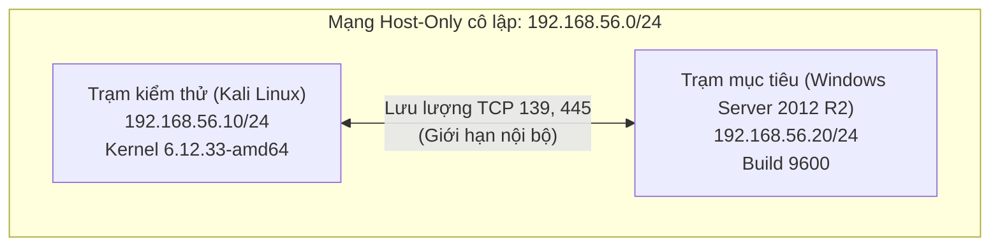
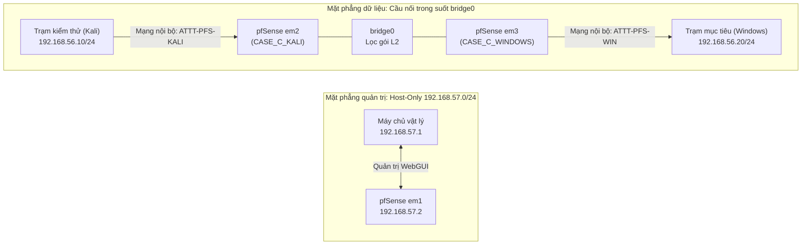

# CHƯƠNG 2. XÂY DỰNG MÔ HÌNH VÀ THIẾT KẾ KỊCH BẢN THỰC NGHIỆM

Chương 2 trình bày thiết kế, cài đặt môi trường mạng thực nghiệm cô lập và chuẩn hóa các kịch bản khảo sát an toàn dịch vụ SMB cùng lỗ hổng MS17-010.

Nội dung gồm cấu hình Kali Linux và Windows Server 2012 R2, hai kịch bản Nmap/NSE, hai biện pháp giảm thiểu đã thực hiện và quy tắc sử dụng dữ liệu cho Chương 3.

## 2.1. Phạm vi và mô hình thực nghiệm

### 2.1.1. Mục tiêu và phạm vi thực nghiệm
Mô hình thực nghiệm được xây dựng để cung cấp môi trường kiểm thử có kiểm soát và có thể tái lập [1]. Mục tiêu chính gồm:
1. **Khảo sát bề mặt dịch vụ:** Đánh giá cấu hình SMB, nhận diện cổng TCP 139, 445 và xác định các dialect SMB được hỗ trợ.
2. **Thăm dò dấu hiệu an ninh:** Thăm dò phản ứng dịch vụ trước gói tin NSE chuẩn hóa liên quan MS17-010 mà không thực hiện thao tác có chủ đích gây gián đoạn.
3. **Đo đạc hiệu quả giảm thiểu:** So sánh sự thay đổi trạng thái mạng và kết quả quét trước và sau can thiệp phòng thủ.
4. **Bảo đảm an toàn kiểm thử:** Ở trạng thái baseline, hai máy ảo chỉ sử dụng Host-Only NIC, không cấu hình NAT/Bridged và không có default route, qua đó giới hạn đường kết nối của chúng trong mạng lab.

Phạm vi thực nghiệm tập trung vào các phương pháp quét phi xâm nhập, không gửi payload khai thác và chỉ ghi nhận phản ứng dịch vụ.

### 2.1.2. Mô hình mạng ở trạng thái baseline
Ở trạng thái baseline, mô hình gồm trạm kiểm thử Kali Linux và trạm mục tiêu Windows Server 2012 R2, kết nối trực tiếp qua mạng Host-Only ảo hóa.



Hình 2.1. Sơ đồ topo kết nối mạng ở trạng thái baseline trên VirtualBox

Cả hai máy ảo cùng thuộc dải mạng `192.168.56.0/24`. Ở trạng thái baseline, hai máy ảo chỉ sử dụng Host-Only NIC, không cấu hình NAT/Bridged và không có default route, qua đó giới hạn đường kết nối của chúng trong mạng lab. Trong kịch bản mở rộng ở Mục 2.5.3, máy ảo pfSense được tích hợp theo mô hình cầu nối trong suốt (Transparent Bridge) để lọc gói mà không thay đổi địa chỉ IP hai đầu.

### 2.1.3. Thành phần và thông số môi trường
Thông số phần cứng, hệ điều hành và cấu hình mạng được tổng hợp trong Bảng 2.1.

Bảng 2.1. Thông số kỹ thuật của các máy ảo trong môi trường thực nghiệm

| Thông số | Trạm kiểm thử (Kali Linux) | Trạm mục tiêu (Windows Server) | Ý nghĩa thiết kế |
| :--- | :--- | :--- | :--- |
| **Hệ điều hành** | Kali Linux (Kernel 6.12.33-amd64) [2] | Windows Server 2012 R2 Eval | Môi trường chuẩn hóa |
| **Bản dựng** | Kali Rolling (Nmap 7.99) | Build 9600 | Hệ điều hành mục tiêu |
| **Phần cứng ảo** | 2 vCPU, 4096 MB RAM | 2 vCPU, 4096 MB RAM | Đồng nhất tài nguyên |
| **IP / Subnet** | `192.168.56.10/24` (Tĩnh) | `192.168.56.20/24` (Tĩnh) | Cố định địa chỉ mạng |
| **Giao diện mạng**| 1 Host-Only NIC (`eth0`) | 1 Host-Only NIC (`Ethernet`) | Cấu hình baseline Host-Only |
| **Cổng dịch vụ** | Cổng nguồn ngẫu nhiên | TCP 139 và TCP 445 [3] | Khảo sát dịch vụ SMB |

Môi trường ảo hóa thiết lập trên Oracle VM VirtualBox 7.2.20. Card mạng máy chủ đóng vai trò host adapter mang địa chỉ `192.168.56.1/24` phục vụ giám sát khi cần thiết.

## 2.2. Chuẩn bị và xác nhận trạng thái ban đầu

### 2.2.1. Cấu hình mạng và hai máy ảo
Môi trường thực nghiệm triển khai trên Oracle VM VirtualBox 7.2.20:
- **Giao diện mạng:** Khởi tạo card mạng Host-Only dải `192.168.56.0/24`, địa chỉ host adapter là `192.168.56.1/24`.
- **Vô hiệu hóa DHCP:** Tắt VirtualBox DHCP Server để ngăn cấp IP động, bảo đảm tính ổn định cho cấu hình IP tĩnh.
- **Cách ly mạng:** Ở trạng thái baseline, hai máy ảo chỉ sử dụng Host-Only NIC, không cấu hình NAT/Bridged và không có default route, qua đó giới hạn đường kết nối của chúng trong mạng lab.

### 2.2.2. Chuẩn bị Kali Linux và công cụ Nmap/NSE
Trạm kiểm thử sử dụng Kali Linux 64-bit (Kernel 6.12.33-amd64) [2]:
- **Cấu hình mạng:** Gán địa chỉ IPv4 tĩnh `192.168.56.10/24` cho giao diện `eth0`.
- **Công cụ khảo sát:** Sử dụng Nmap 7.99 cùng các kịch bản NSE sẵn có (`smb-protocols`, `smb-os-discovery`, `smb2-security-mode`, `smb2-capabilities`, `smb-vuln-ms17-010`) phục vụ thu thập dữ liệu an ninh.

### 2.2.3. Chuẩn bị Windows Server, SMB và Windows Firewall
Trạm mục tiêu sử dụng Windows Server 2012 R2 Standard Evaluation Build 9600:
- **Cấu hình mạng:** Thiết lập địa chỉ tĩnh `192.168.56.20/24` trên giao diện `Ethernet`.
- **Dịch vụ SMB:** Dịch vụ SMB (`LanmanServer`) đặt chế độ tự động (`Automatic`) và đang chạy (`Running`), lắng nghe trên TCP 445 (Direct-hosted SMB) và TCP 139 (NetBIOS Session Service) [3].
- **Giao thức:** Cả SMBv1 và SMBv2 đều bật (`EnableSMB1Protocol = True`, `EnableSMB2Protocol = True`), tính năng `FS-SMB1` cài đặt đầy đủ.
- **Tường lửa:** Windows Firewall bật (`Enabled`), giữ quy tắc cho phép TCP 139 và 445 từ `192.168.56.10` phục vụ thực nghiệm; nhóm File and Printer Sharing mặc định không mở rộng.

### 2.2.4. Xác định trạng thái bản vá MS17-010
Hiện trạng an ninh trạm mục tiêu được xác minh qua PowerShell trước khi đo đạc:
- **Danh mục hotfix:** Lệnh `Get-HotFix` xác nhận danh mục cập nhật nội bộ không ghi nhận KB4012213, KB4012216 hoặc bản cập nhật thay thế theo bản tin MS17-010 [4].
- **Driver nhân:** Tệp driver `srv.sys` tại `C:\Windows\System32\drivers\srv.sys` có FileVersion String `6.3.9600.16384` và phiên bản số `6.3.9600.16421`.
- **Đối chiếu ngưỡng phiên bản đã cập nhật:** Giá trị này thấp hơn ngưỡng phiên bản đã cập nhật tối thiểu `6.3.9600.18604` theo công bố của Microsoft [5].
- **Trạng thái:** Hệ thống được xác định ở trạng thái chưa vá (`UNPATCHED`) để làm đối chứng ban đầu.

### 2.2.5. Snapshot và kiểm tra trước thực nghiệm
Để bảo đảm khả năng tái lập và kiểm soát sai số, các điều kiện tiền thực nghiệm được thiết lập:
- **Tạo mốc phục hồi:** Tạo snapshot `Before Demo` trên cả hai máy ảo VirtualBox sau khi xác minh cấu hình ban đầu, dùng làm mốc đưa môi trường về baseline khi chuyển đổi kịch bản.
- **Kiểm tra thông tuyến:** Kiểm tra kết nối mạng cơ bản giữa `192.168.56.10` và `192.168.56.20`, xác nhận hai máy phản hồi bình thường trước khi quét dịch vụ.

## 2.3. Kịch bản 1 — Khảo sát dịch vụ SMB bằng Nmap

### 2.3.1. Mục tiêu và dữ liệu cần quan sát
Kịch bản 1 thực hiện khảo sát bề mặt dịch vụ SMB từ góc độ người đánh giá an ninh mạng:
- **Mục tiêu:** Xác định tính sẵn sàng của máy mục tiêu, kiểm tra socket TCP 139 và 445, nhận diện phiên bản dịch vụ và các dialect SMB được hỗ trợ.
- **Dữ liệu cần quan sát:** Phản hồi ARP, trạng thái cổng, cờ phản hồi TCP tại trường REASON, chuỗi dịch vụ (`microsoft-ds`, `netbios-ssn`), hệ điều hành và danh sách dialect SMB.
- **Nguyên tắc an toàn:** Toàn bộ lệnh quét chỉ thu thập thông tin cấu hình, không can thiệp sâu hay làm gián đoạn máy chủ mục tiêu.

### 2.3.2. Quy trình quét và các lệnh thực hiện
Quy trình Kịch bản 1 gồm 6 bước kỹ thuật tuần tự được thực thi từ trạm kiểm thử Kali Linux. Chi tiết các bước và lệnh thực hiện được tổng hợp trong Bảng 2.2.

Bảng 2.2. Quy trình các bước thực hiện trong Kịch bản 1

| Bước | Lệnh thực hiện | Mục đích kỹ thuật | Nội dung cần quan sát |
| :--- | :--- | :--- | :--- |
| **B1** | `ip addr show; ip route show` | Kiểm tra IP và định tuyến trạm kiểm thử | Địa chỉ `eth0` (`192.168.56.10/24`) và bảng định tuyến subnet |
| **B2** | `sudo nmap -sn -PR 192.168.56.0/24 -T3 --max-retries 2 -oA b2_host_discovery` | Khảo sát các trạm hoạt động trong subnet | Danh sách IP phản hồi thăm dò ARP trong mạng |
| **B3** | `sudo nmap -sn -PR 192.168.56.20 -T3 --max-retries 2 -oA b3_target_alive` | Xác nhận riêng tính sẵn sàng của máy mục tiêu | Trạng thái phản hồi của `192.168.56.20` |
| **B4** | `sudo nmap -sS -p 139,445 192.168.56.20 -T3 --max-retries 2 --reason -oA b4_smb_ports` | Quét trạng thái cổng TCP 139 và 445 [6] | Trạng thái cổng và trường REASON do Nmap trả về |
| **B5** | `sudo nmap -sS -sV --version-intensity 5 -p 139,445 192.168.56.20 -T3 --max-retries 2 -oA b5_smb_version` | Nhận diện phiên bản dịch vụ và hệ điều hành | Chuỗi service/version fingerprint do Nmap trả về |
| **B6** | `sudo nmap -sS -p 139,445 --script smb-protocols,smb-os-discovery,smb2-security-mode,smb2-capabilities 192.168.56.20 -T3 --max-retries 2 -oA b6_smb_nse` | Khảo sát đặc trưng an toàn giao thức SMB [7], [8] | Danh sách dialect SMB, chính sách ký số và các capability do script trả về |

Các tham số quét gồm `-sS` (quét TCP SYN nửa mở), `-sV` (nhận diện phiên bản với `--version-intensity 5`), `--reason` (hiển thị cờ trạng thái) và `-oA` (xuất đồng thời 3 định dạng tệp thô).

### 2.3.3. Giới hạn kết luận của Kịch bản 1
Dữ liệu thu được từ Kịch bản 1 chỉ phản ánh bề mặt dịch vụ nhìn từ bên ngoài:
1. `445 open != vulnerable`: Cổng TCP 139 và 445 mở chỉ xác nhận dịch vụ SMB đang lắng nghe kết nối, chưa đủ căn cứ khẳng định hệ thống tồn tại lỗ hổng bảo mật.
2. `SMBv1 enabled != MS17-010 confirmed`: SMBv1 được bật chỉ cho thấy giao thức liên quan còn được hỗ trợ; trạng thái này không đủ để xác nhận MS17-010. Việc đánh giá cần đối chiếu thêm trạng thái bản vá nội bộ và kết quả kiểm tra từ xa.

Kết quả Kịch bản 1 đóng vai trò định danh dịch vụ, làm tiền đề cho các phép đo chuyên sâu trong Kịch bản 2.

## 2.4. Kịch bản 2 — Kiểm tra dấu hiệu MS17-010 bằng NSE

### 2.4.1. Mục tiêu và điều kiện thực hiện
Kịch bản 2 mở rộng khảo sát an ninh bằng cách sử dụng các kịch bản NSE để nhận diện chỉ dấu liên quan đến lỗ hổng MS17-010:
- **Mục tiêu:** Thăm dò phản ứng của dịch vụ SMB trước các gói tin nghiệp vụ chuẩn hóa, kiểm tra sự tồn tại của SMBv1 và khảo sát dấu hiệu an ninh mà không gây mất ổn định máy chủ.
- **Điều kiện thực hiện:** Hoàn thành Kịch bản 1, xác nhận đường truy cập SMB đáp ứng điều kiện tiếp tục kiểm tra và hệ thống đã lưu mốc snapshot `Before Demo`.

### 2.4.2. Bốn phép đo NSE-SMB-01 đến NSE-SMB-04
Quy trình Kịch bản 2 chuẩn hóa thành 4 phép đo tuần tự từ `NSE-SMB-01` đến `NSE-SMB-04` thực hiện từ trạm kiểm thử Kali Linux. Chi tiết các phép đo được mô tả trong Bảng 2.3.

Bảng 2.3. Danh mục 4 phép đo trong Kịch bản 2

| Phép đo | Lệnh thực hiện | Mục đích kỹ thuật | Thông tin cần ghi nhận |
| :--- | :--- | :--- | :--- |
| **NSE-SMB-01** | `sudo nmap -sS -p 139,445 -n -T3 --max-retries 2 --reason -oA evidence/nse-smb/NSE-SMB-01_ports 192.168.56.20` | Kiểm tra tính sẵn sàng của cổng SMB trước đo đạc | Trạng thái TCP 139/445 và trường REASON |
| **NSE-SMB-02** | `nmap -p 445 -n -T3 --max-retries 2 --script smb-protocols -oA evidence/nse-smb/NSE-SMB-02_protocols 192.168.56.20` | Liệt kê chi tiết các dialect SMB được hỗ trợ | Danh sách dialect SMB do script trả về |
| **NSE-SMB-03** | `nmap -p 445 -n -T3 --max-retries 2 --script smb2-security-mode -oA evidence/nse-smb/NSE-SMB-03_signing 192.168.56.20` | Thăm dò cấu hình ký số SMB2/SMB3 từ xa | Chính sách ký số SMB do script trả về |
| **NSE-SMB-04** | `nmap -p 445 -n -T3 --max-retries 2 --script smb-vuln-ms17-010 -oA evidence/nse-smb/NSE-SMB-04_ms17010 192.168.56.20` | Kiểm tra dấu hiệu lỗ hổng MS17-010 [9] | Script output / verdict nếu có |

Các phép đo dùng tùy chọn `-n` để bỏ qua phân giải DNS giúp tối ưu tốc độ, `-T3` bảo đảm độ ổn định và tham số `-oA` xuất toàn bộ kết quả phục vụ đối chứng.

### 2.4.3. Đối chiếu kết quả từ xa với trạng thái bản vá nội bộ
Khi đánh giá kết quả Kịch bản 2, cần kết hợp kết quả đo đạc từ xa với trạng thái bản vá nội bộ:
- **Ghi nhận khách quan:** Kết quả script thăm dò từ xa phải được ghi nhận trung thực theo đầu ra thực tế của công cụ.
- **Ranh giới không xác định:** Trường hợp script không trả về kết luận rõ ràng, kết quả phân loại là `UNKNOWN / NO USABLE SCRIPT RESULT`. Tuyệt đối không suy diễn kết quả không xác định thành an toàn (`UNKNOWN != SAFE`).
- **Khóa ký số:** Phân biệt rõ cấu hình signing nội bộ trên PowerShell (`RequireSecuritySignature`, `EnableSecuritySignature`) với kết quả đo đạc từ xa của `smb2-security-mode`. Kết quả từ xa chỉ phản ánh trạng thái thương lượng trên luồng kết nối, không thay thế cấu hình cục bộ.

## 2.5. Kiểm thử hai biện pháp giảm thiểu đã thực hiện

### 2.5.1. Nguyên tắc đối chiếu trước và sau can thiệp
Để đánh giá tác động phòng thủ, đồ án áp dụng phương pháp kiểm thử đối chiếu: giữ nguyên các trạng thái quan trọng của Kali Linux và Windows Server khi có thể, áp dụng từng biện pháp riêng biệt và thực hiện lại các phép đo phù hợp để so sánh với baseline.

Thiết kế các kịch bản thực nghiệm và kế hoạch đo đạc đối chiếu được trình bày trong Bảng 2.4.

Bảng 2.4. Thiết kế các kịch bản thực nghiệm và kế hoạch đo đạc đối chiếu

| Kịch bản | Phạm vi can thiệp | Thao tác thực hiện | Kế hoạch đo đạc đối chiếu |
| :--- | :--- | :--- | :--- |
| **Baseline** | Không can thiệp | Giữ nguyên hiện trạng ban đầu | Thực hiện đầy đủ Kịch bản 1 và Kịch bản 2 |
| **Case B** | Cấu hình dịch vụ hệ điều hành | Vô hiệu hóa SMBv1 bằng PowerShell | Thực hiện lại NSE-SMB-02 (`smb-protocols`) và NSE-SMB-04 (`smb-vuln-ms17-010`) |
| **Case C** | Tầng mạng (L2/L3) | Lọc gói bằng pfSense Transparent Bridge | Quét lại cổng SMB (tương đương NSE-SMB-01) và script MS17-010 (tương đương NSE-SMB-04) |

Biện pháp cập nhật bản vá đóng vai trò tham chiếu kỹ thuật trong phần thảo luận tại Chương 4, không nằm trong các ca can thiệp thực nghiệm đo đạc lại của đồ án.

### 2.5.2. Vô hiệu hóa SMBv1 trên Windows Server
Biện pháp giảm thiểu thứ nhất (Case B) can thiệp ở tầng dịch vụ hệ điều hành theo khuyến nghị của Microsoft [10], nhằm vô hiệu hóa SMBv1 trong cấu hình SMB Server.

- **Thao tác can thiệp:** Trên Windows Server 2012 R2, mở PowerShell Administrator và thực thi câu lệnh:
```powershell
Set-SmbServerConfiguration -EnableSMB1Protocol $false -Force
```
- **Xác thực cấu hình:** Kiểm tra lại trạng thái cấu hình dịch vụ SMB bằng lệnh:
```powershell
Get-SmbServerConfiguration | Select-Object EnableSMB1Protocol, EnableSMB2Protocol
```
- **Kế hoạch đo đạc đối chiếu:** Sau khi tắt SMBv1, thực hiện lại hai phép đo từ trạm kiểm thử Kali Linux:
```bash
nmap -p 445 -n -T3 --max-retries 2 --script smb-protocols -oA evidence/nse-smb/NSE-SMB-02_protocols 192.168.56.20

nmap -p 445 -n -T3 --max-retries 2 --script smb-vuln-ms17-010 -oA evidence/nse-smb/NSE-SMB-04_ms17010 192.168.56.20
```
- **Ranh giới an ninh:** Trong kịch bản không thực hiện bước khởi động lại máy và không thực hiện thao tác gỡ tính năng `FS-SMB1`. Việc vô hiệu hóa SMBv1 trong cấu hình SMB Server không thay đổi mã nhị phân driver nhân `srv.sys` (`SMBv1 disabled != PATCHED`).

### 2.5.3. Kiểm soát SMB bằng pfSense Transparent Bridge
Biện pháp giảm thiểu thứ hai (Case C) triển khai tường lửa chuyên dụng theo NIST SP 800-41 Rev. 1 [11]. pfSense CE 2.9.0 đóng vai trò cầu nối trong suốt (Transparent Bridge) L2, cho phép lọc gói mà không thay đổi dải IP `192.168.56.0/24` của hai trạm.



Hình 2.2. Sơ đồ kiến trúc mạng pfSense Transparent Bridge trong kịch bản Case C

- **Mặt phẳng dữ liệu và quản trị:** Giao diện `em2` (nội bộ `ATTT-PFS-KALI`) và `em3` (`ATTT-PFS-WIN`) ghép thành `bridge0`. Quản trị dùng `em1` trên Host-Only thứ hai (`192.168.57.0/24`, IP `192.168.57.2`), truy cập WebGUI từ máy vật lý `192.168.57.1`.
- **Thông số nhân:** Cấu hình `System Tunables` của pfSense gồm `net.link.bridge.pfil_member = 1` (lọc trên giao diện thành viên), `net.link.bridge.pfil_bridge = 0` (tắt lọc trên bridge tổng) và `net.link.bridge.pfil_onlyip = 1` (chỉ truyền gói tin IP qua bridge).
- **Luật tường lửa:** Cấu hình luật chặn (`Block`) lưu lượng IPv4 TCP từ nguồn `192.168.56.10` tới đích `192.168.56.20` trên cổng 139, 445 tại giao diện `em2`, đồng thời bật ghi log (`Log packets`).
- **Kế hoạch đối chiếu:** Thực hiện lại phép quét cổng (tương đương NSE-SMB-01) và kịch bản MS17-010 (tương đương NSE-SMB-04) từ Kali Linux để đối chiếu khả năng tiếp cận dịch vụ và kiểm tra log tường lửa.
- **Ranh giới an ninh:** Khả năng tiếp cận dịch vụ bị kiểm soát qua tường lửa không chứng minh máy chủ nội bộ đã được vá lỗ hổng (`FILTERED != PATCHED`).

## 2.6. Dữ liệu thực nghiệm và nguyên tắc sử dụng

### 2.6.1. Dữ liệu được thu thập và lưu trữ
Để phục vụ phân tích chi tiết và bảo đảm tính minh chứng ở Chương 3, dữ liệu thực nghiệm được lưu trữ theo các định dạng chuẩn:
1. **Tập tin nhật ký Nmap (`-oA`):** Mỗi lệnh quét xuất ra 3 định dạng đồng thời gồm tệp văn bản trực quan (`.nmap`), tệp máy đọc (`.xml`) và tệp lọc dòng lệnh (`.gnmap`).
2. **Trạng thái nội bộ máy mục tiêu:** Lưu trữ kết quả lệnh PowerShell kiểm tra cập nhật (`Get-HotFix`), cấu hình SMB (`Get-SmbServerConfiguration`) và phiên bản driver `srv.sys`.
3. **Cấu hình và nhật ký tường lửa:** Lưu trữ thiết lập giao diện mạng, cấu hình cầu nối `bridge0`, tham số nhân và nhật ký chặn gói của pfSense.
4. **Ảnh chụp màn hình:** Lưu trữ hình ảnh giao diện máy ảo và terminal làm minh chứng trực quan hỗ trợ đối soát.

### 2.6.2. Phạm vi dữ liệu dùng cho đánh giá
Việc đánh giá kết quả thực nghiệm tại Chương 3 tuân thủ nguyên tắc chọn lọc khoa học:
- **Dữ liệu được chấp nhận:** Chỉ sử dụng bộ dữ liệu thực nghiệm chính thức, hoàn chỉnh thu được từ các phiên chạy theo kịch bản chuẩn hóa (trạng thái baseline, Kịch bản 1, Kịch bản 2, các phép đo lại của Case B và cấu hình kèm kết quả Case C).
- **Dữ liệu phục vụ phân tích và đối soát:** Dữ liệu từ các lần chạy thử nghiệm môi trường sơ bộ, các phiên kiểm tra phục hồi (HostRepair) hoặc các bản ghi gián đoạn vẫn được lưu trữ đầy đủ để phục vụ truy vết kỹ thuật. Nhóm dữ liệu này không được dùng làm tập kết quả chính nhằm bảo đảm tính khách quan và nhất quán của kết quả đánh giá.

### 2.6.3. Nguyên tắc diễn giải kết quả
Quá trình phân tích dữ liệu thực nghiệm tuân thủ 5 ranh giới suy luận an toàn cốt lõi:
1. `445 open != vulnerable`: Cổng mở chỉ khẳng định socket đang lắng nghe, chưa đủ kết luận hệ thống có lỗ hổng.
2. `SMBv1 enabled != MS17-010 confirmed`: SMBv1 được bật chỉ cho thấy giao thức liên quan còn được hỗ trợ; trạng thái này không đủ để xác nhận MS17-010. Việc đánh giá cần đối chiếu thêm trạng thái bản vá nội bộ và kết quả kiểm tra từ xa.
3. `UNKNOWN != SAFE`: Khi script thăm dò không trả về kết luận rõ ràng, trạng thái được ghi nhận là `UNKNOWN / NO USABLE SCRIPT RESULT`, không được suy diễn thành an toàn.
4. `FILTERED != PATCHED`: FILTERED cho biết Nmap không nhận đủ phản hồi để phân loại cổng là open hay closed; trạng thái này không chứng minh máy chủ đã được vá.
5. `SMBv1 disabled != PATCHED`: Tắt SMBv1 chỉ loại bỏ bề mặt giao thức ở tầng dịch vụ, không thay đổi mã nhị phân driver nhân.

Đồng thời, đồ án không so sánh các mốc thời gian hiển thị giữa các máy ảo như một đồng hồ thống nhất, tránh suy diễn sai lệch về trình tự thời gian.

## 2.7. Tổng kết chương

Chương 2 đã hoàn thành thiết kế mô hình thực nghiệm và các kịch bản kiểm thử cho dịch vụ SMB cùng MS17-010. Mạng Host-Only trên Oracle VM VirtualBox 7.2.20 giới hạn đường kết nối của hai máy ảo trong lab; snapshot `Before Demo` được dùng làm mốc phục hồi.

Thông số trạm kiểm thử Kali Linux và máy mục tiêu Windows Server 2012 R2 đã được chuẩn hóa. Đồ án xây dựng quy trình 6 bước cho Kịch bản 1, 4 phép đo cho Kịch bản 2, cùng phương pháp kiểm thử đối chiếu cho hai giải pháp giảm thiểu gồm vô hiệu hóa SMBv1 và tường lửa pfSense Transparent Bridge.

Các tệp kết quả và nguyên tắc diễn giải trên được dùng làm cơ sở phân tích tại Chương 3.
