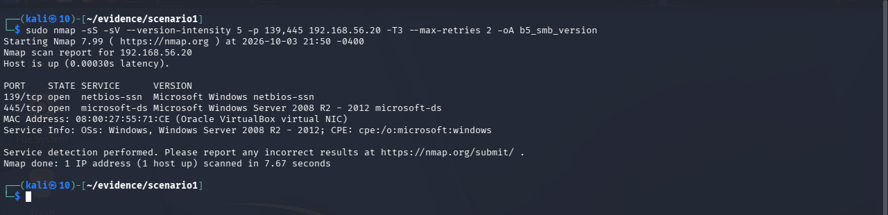
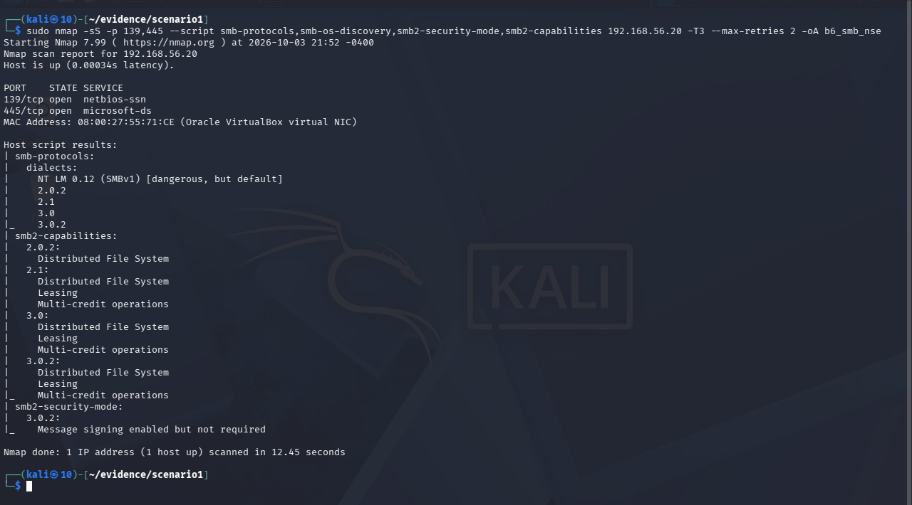
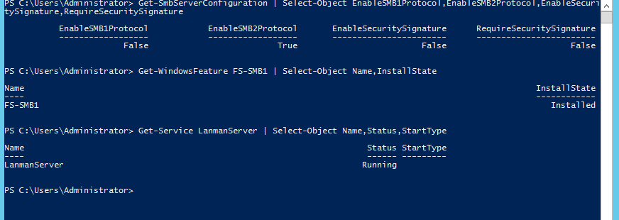
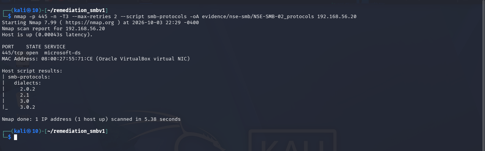
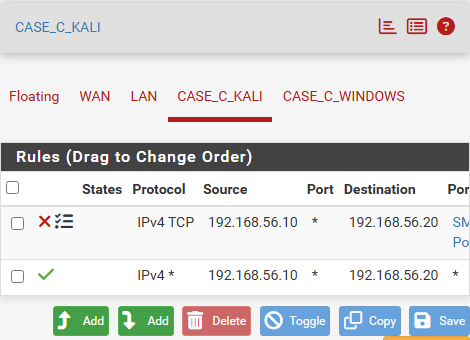
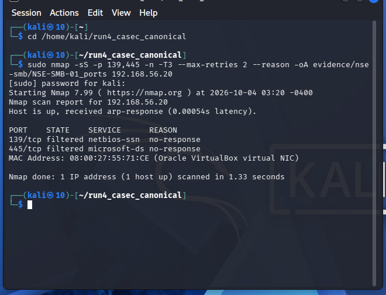
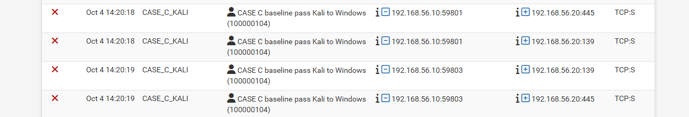

# CHƯƠNG 3. KẾT QUẢ THỰC NGHIỆM VÀ PHÂN TÍCH

## 3.1. Trạng thái baseline trước đo đạc

Việc xác định và ghi nhận trạng thái ban đầu (baseline) của hệ thống máy chủ mục tiêu trước khi thực hiện các kịch bản thực nghiệm nhằm tạo mốc tham chiếu nhất quán để đối chiếu các phép đo tiếp theo. Mốc xuất phát này ghi nhận các thông số định lượng cụ thể về cấu hình địa chỉ mạng, trạng thái dịch vụ chia sẻ tệp Server Message Block (SMB) và chính sách tường lửa. Thiết lập này cũng xác định mức độ cập nhật bản vá an ninh thực tế trên hệ điều hành Windows Server 2012 R2. Các dữ liệu đo đạc cục bộ thu thập tại thời điểm này đóng vai trò mốc đối chiếu độc lập đối với các tín hiệu phản hồi mạng đo được từ trạm kiểm thử trong các giai đoạn sau.

### 3.1.1. Trạng thái mạng và dịch vụ SMB

Môi trường thực nghiệm được thiết lập trên nền tảng ảo hóa với hai máy ảo chính gồm trạm kiểm thử Kali Linux và máy chủ mục tiêu Windows Server 2012 R2. Cả hai máy ảo đều được cấu hình duy nhất một bộ điều hợp mạng chế độ Host-Only Adapter, không gắn thêm card mạng NAT hay Bridged, qua đó giới hạn đường truyền dữ liệu trong phạm vi phân đoạn mạng thử nghiệm nội bộ. Bảng định tuyến trên trạm Kali Linux ghi nhận dải mạng cục bộ 192.168.56.0/24 qua giao diện eth0 với địa chỉ IP 192.168.56.10/24 và không kích hoạt tuyến đường mặc định (default route). Tương tự, máy chủ Windows Server 2012 R2 được ghi nhận địa chỉ IP 192.168.56.20/24 trên giao diện mạng Ethernet và bảng định tuyến cục bộ không ghi nhận tuyến mặc định.

Trên máy chủ mục tiêu, dịch vụ chia sẻ tệp LanmanServer được ghi nhận ở trạng thái Running với chế độ khởi động tự động (Automatic). Thành phần tính năng FS-SMB1 hiển thị trạng thái đã cài đặt (Installed) trên hệ điều hành. Cấu hình SMB Server ghi nhận hai thuộc tính EnableSMB1Protocol và EnableSMB2Protocol đều mang giá trị True. Đây là trạng thái cấu hình cục bộ; các dialect thực sự quan sát được từ xa được trình bày ở Kịch bản 1. Hai thuộc tính ký số cục bộ EnableSecuritySignature và RequireSecuritySignature được ghi nhận mang giá trị False; kết quả signing quan sát từ xa được trình bày riêng ở Kịch bản 1 và Kịch bản 2. Lệnh kiểm tra kết nối mạng cục bộ xác nhận tiến trình hệ thống (PID 4) đang mở cổng lắng nghe (Listen) trên cổng TCP 445 ứng với địa chỉ :: và cổng TCP 139 ứng với địa chỉ 192.168.56.20.

Bảng 3.1 tổng hợp chi tiết các thông số mạng, dịch vụ chia sẻ tệp và cấu hình tường lửa ghi nhận được trên hai máy ảo tại thời điểm xuất phát.

**Bảng 3.1. Trạng thái mạng, dịch vụ SMB và Windows Firewall trước đo đạc**

| Hạng mục | Giá trị ghi nhận | Ghi chú |
|---|---|---|
| Địa chỉ IP và mạng con Kali Linux | `192.168.56.10/24` (giao diện `eth0`) | Tuyến mạng cục bộ `192.168.56.0/24`, không cấu hình default route |
| Địa chỉ IP và mạng con Windows Server | `192.168.56.20/24` (giao diện `Ethernet`) | Bảng định tuyến cục bộ, không cấu hình default route |
| Cấu hình card mạng VirtualBox | 1 card Host-Only Adapter trên mỗi máy ảo | Cấu hình giới hạn đường truyền trong phân đoạn lab, không cấu hình card NAT hay Bridged |
| Dịch vụ chia sẻ tệp (LanmanServer) | `Running` (chế độ khởi động `Automatic`) | Dịch vụ SMB đang chạy cục bộ trên máy chủ mục tiêu |
| Tính năng Windows FS-SMB1 | `Installed` | Thành phần SMBv1 được cài đặt sẵn trên hệ điều hành |
| Cấu hình giao thức SMB Server | `EnableSMB1Protocol : True` `EnableSMB2Protocol : True` | Cả hai thuộc tính cấu hình cục bộ đều có giá trị True |
| Chính sách ký số gói tin SMB nội bộ | `EnableSecuritySignature : False` `RequireSecuritySignature : False` | Thiết lập ký số cục bộ không bắt buộc |
| Trạng thái lắng nghe cổng cục bộ | TCP 445 (`::`) TCP 139 (`192.168.56.20`) | Tiến trình hệ thống đang lắng nghe cục bộ trên cổng 139 và 445 |
| Trạng thái hồ sơ Windows Firewall | Domain: `True`, Private: `True`, Public: `True` | Cả ba hồ sơ Windows Firewall có Enabled=True |
| Nhóm quy tắc chia sẻ tệp mặc định | 16 quy tắc `File and Printer Sharing` đều `False` | Các quy tắc chia sẻ tệp mặc định đều bị vô hiệu hóa |
| Quy tắc tường lửa tùy biến | Tên: `ATTT Lab SMB 139-445` Action: `Allow`, Direction: `Inbound` Protocol: `TCP`, LocalPort: `{139, 445}` | Quy tắc cho phép có phạm vi RemoteAddress giới hạn duy nhất tại `192.168.56.10` |

Hình 3.1 trình bày kết quả kiểm tra tổng hợp cấu hình mạng, trạng thái dịch vụ chia sẻ tệp và các cổng lắng nghe trên máy chủ Windows Server 2012 R2 thông qua giao diện Windows PowerShell trước thực nghiệm.

Các dữ liệu hiển thị trên Hình 3.1 xác thực cấu hình mạng của giao diện Ethernet với địa chỉ 192.168.56.20/24, trạng thái dịch vụ LanmanServer, việc cài đặt tính năng FS-SMB1 và các socket 139/445 đang ở trạng thái Listen trên máy chủ. Trạng thái lắng nghe cục bộ không tự xác định trạng thái cổng nhìn từ trạm Kali; khả năng tiếp cận từ xa phải được đo riêng qua đường mạng và chính sách lọc hiện hành.

Về cấu hình tường lửa cục bộ, Windows Firewall ghi nhận cả ba hồ sơ mạng Domain, Private và Public đều có thuộc tính Enabled mang giá trị True. Toàn bộ 16 quy tắc mặc định thuộc nhóm File and Printer Sharing hiển thị ở trạng thái vô hiệu hóa (False). Trên máy chủ, một quy tắc tùy biến mang tên ATTT Lab SMB 139-445 được kích hoạt với chiều đi vào (Inbound), hành động cho phép (Allow), giao thức TCP trên hai cổng cục bộ 139 và 445, cùng phạm vi địa chỉ nguồn từ xa (RemoteAddress) là 192.168.56.10.

Thuộc tính cấu hình của quy tắc tường lửa tùy biến ATTT Lab SMB 139-445 cùng trạng thái các hồ sơ tường lửa trên máy chủ mục tiêu được thể hiện tại Hình 3.2.

Hình 3.2 xác nhận quy tắc tùy biến được cấu hình cho TCP 139/445 với phạm vi địa chỉ nguồn 192.168.56.10, đồng thời nhóm File and Printer Sharing mặc định được ghi nhận ở trạng thái tắt. Đây là trạng thái cấu hình tại baseline; khả năng tiếp cận dịch vụ từ Kali được kiểm tra bằng các phép đo từ xa ở phần tiếp theo.

### 3.1.2. Trạng thái bản vá và mốc phục hồi

Để xác định trạng thái cập nhật liên quan MS17-010, đề tài đối chiếu thông tin phiên bản srv.sys và danh mục hotfix cục bộ với tài liệu Microsoft. Truy vấn tệp srv.sys tại đường dẫn C:\Windows\System32\drivers\srv.sys ghi nhận chuỗi FileVersion hiển thị là 6.3.9600.16384 (winblue_rtm.130821-1623).

Để thu được giá trị phiên bản số nhị phân, quy trình kiểm tra thực hiện ghép nối bốn trường FileMajorPart, FileMinorPart, FileBuildPart và FilePrivatePart từ tiêu đề tệp driver, xác định phiên bản số thực tế của tệp srv.sys là 6.3.9600.16421. Theo Microsoft Security Bulletin MS17-010 và tài liệu hỗ trợ “How to verify that MS17-010 is installed”, ngưỡng phiên bản đã cập nhật tối thiểu của srv.sys đối với nền tảng Windows Server 2012 R2 là 6.3.9600.18604, tương ứng với việc cài đặt gói cập nhật KB4012213 hoặc KB4012216. Phép so sánh số học cho thấy giá trị phiên bản số của máy chủ mục tiêu thấp hơn ngưỡng phiên bản đã cập nhật tương ứng (6.3.9600.16421 < 6.3.9600.18604).

<!-- CITE-ANCHOR: S005, S032; final IEEE numbering deferred to global normalization gate -->

Song song với việc đối chiếu phiên bản driver, danh mục cập nhật hệ thống được kiểm tra qua lệnh Get-HotFix. Danh mục Get-HotFix quan sát được gồm sáu mục (KB2919355, KB2919442, KB2937220, KB2938772, KB2939471 và KB2949621) có ngày cài đặt 21/03/2014; trong danh mục này không ghi nhận KB4012213, KB4012216 hoặc bản cập nhật thay thế đã được ánh xạ là chứa bản sửa lỗi MS17-010.

Dựa trên phiên bản số nhị phân thấp hơn ngưỡng cập nhật tối thiểu và danh mục hotfix quan sát được, trạng thái bản vá của máy chủ được phân loại là UNPATCHED đối với MS17-010. UNPATCHED là phân loại trạng thái bản vá cục bộ và không tự tạo ra một phán quyết lỗ hổng từ phép đo từ xa.

Snapshot Before Demo được ghi nhận cho cả hai máy ảo ở trạng thái poweroff và được chọn làm mốc phục hồi của thực nghiệm.

Bảng 3.2 tổng hợp các tiêu chí đối chiếu phiên bản driver, danh mục bản vá và mốc phục hồi hệ thống trước khi bắt đầu đo đạc.

**Bảng 3.2. Trạng thái bản vá và mốc phục hồi**

| Hạng mục | Giá trị ghi nhận | Ghi chú / căn cứ đối chiếu ngắn |
|---|---|---|
| Chuỗi phiên bản hiển thị tệp `srv.sys` | `FileVersion: 6.3.9600.16384 (winblue_rtm.130821-1623)` | Chuỗi ký tự thuộc tính hiển thị của tệp driver |
| Phiên bản số nhị phân tệp `srv.sys` | `6.3.9600.16421` | Trích xuất từ 4 trường số FileMajor, FileMinor, FileBuild, FilePrivate |
| Ngưỡng phiên bản cập nhật tối thiểu | `6.3.9600.18604` | Căn cứ tài liệu Microsoft Support (Article 4023262) cho Windows Server 2012 R2 |
| Mã bản vá liên quan khắc phục MS17-010 | `KB4012213` (Security Only) hoặc `KB4012216` (Monthly Rollup) | Các gói cập nhật chính thức áp dụng cho Windows Server 2012 R2 |
| Danh mục bản vá hệ thống ghi nhận | 6 bản vá (KB2919355, KB2919442, KB2937220, KB2938772, KB2939471, KB2949621 cài ngày 21/03/2014) | Trong danh mục quan sát được không ghi nhận KB4012213, KB4012216 hoặc bản cập nhật thay thế đã được ánh xạ là chứa bản sửa lỗi MS17-010 |
| Phân loại trạng thái bản vá cục bộ | **`UNPATCHED`** | Phiên bản số nhị phân thấp hơn ngưỡng cập nhật tối thiểu ($6.3.9600.16421 < 6.3.9600.18604$) và thiếu bản vá tương ứng trong danh mục quan sát được |
| Mốc khôi phục môi trường (Snapshot) | `Before Demo` | Ghi nhận cho cả hai máy ảo ở trạng thái poweroff tại thời điểm xác minh |

Kết quả kiểm tra thuộc tính phiên bản của driver nhân srv.sys kết hợp danh mục các bản vá hệ thống trên máy chủ Windows Server 2012 R2 được trình bày tại Hình 3.3.

Hình 3.3 thể hiện chuỗi phiên bản hiển thị 6.3.9600.16384, kết quả tính toán phiên bản số 6.3.9600.16421 qua các trường nhị phân và danh sách 6 bản cập nhật hệ thống từ năm 2014. Hai nhóm dữ liệu phiên bản và hotfix được dùng cùng với ngưỡng Microsoft để phân loại trạng thái bản vá cục bộ.

Trên cơ sở trạng thái baseline này, Mục 3.2 trình bày các kết quả khảo sát SMB từ trạm Kali Linux.

## 3.2. Kết quả Kịch bản 1 — Khảo sát dịch vụ SMB

Sau khi xác lập mốc xuất phát chuẩn tại Mục 3.1, tiến trình thực nghiệm Kịch bản 1 được thực hiện nhằm khảo sát bề mặt phơi bày của dịch vụ chia sẻ tệp Server Message Block (SMB) trên hệ thống mục tiêu từ góc nhìn của trạm kiểm thử Kali Linux. Trên cùng phân đoạn mạng nội bộ Host-Only, chuỗi đo đạc được triển khai tuần tự theo tiến trình khám phá từ mức mạng, mức giao vận đến mức ứng dụng. Quá trình bắt đầu từ việc phát hiện các trạm mạng hoạt động, xác nhận mục tiêu trực tuyến và kiểm tra trạng thái mở của các cổng dịch vụ SMB. Tiếp đó, trạm kiểm thử thăm dò dấu vết hệ điều hành từ xa và phân tích các đặc tính giao thức SMB thông qua tập kịch bản Nmap NSE. Các kết quả thu thập được ở giai đoạn này cung cấp bức tranh thực tế về khả năng tiếp cận dịch vụ trước khi bước vào các phép đo kiểm định dấu hiệu lỗ hổng chuyên sâu.

### 3.2.1. Khảo sát trạm mạng và trạng thái mở cổng dịch vụ SMB

Tiến trình khảo sát bắt đầu bằng phép rà quét tầng liên kết dữ liệu qua giao thức ARP trên toàn bộ dải mạng thử nghiệm 192.168.56.0/24 từ trạm Kali Linux. Kết quả quét phát hiện bốn địa chỉ IP đang hoạt động trong phân đoạn mạng gồm 192.168.56.1, 192.168.56.10, 192.168.56.20 và 192.168.56.100. Trong số các thực thể này, địa chỉ 192.168.56.10 là trạm kiểm thử Kali Linux và địa chỉ 192.168.56.20 là máy chủ Windows Server 2012 R2 được chỉ định trong mô hình thực nghiệm. Thực thể mang địa chỉ 192.168.56.100 ghi nhận phản hồi trong phân đoạn mạng nhưng danh tính duy trì trạng thái chưa xác định (UNKNOWN identity); báo cáo không đưa ra bất kỳ suy đoán nào về vai trò của thực thể này. Ngay sau khi phát hiện dải mạng, một phép thăm dò ARP đơn điểm nhắm riêng vào địa chỉ 192.168.56.20 xác nhận mục tiêu vẫn đang trực tuyến (Host is up) trước khi thực hiện các phép đo tiếp theo.

Tại tầng giao vận, trạm kiểm thử tiến hành quét TCP SYN đối với hai cổng dịch vụ SMB tiêu chuẩn là cổng NetBIOS Session Service (TCP 139) và cổng Microsoft-DS (TCP 445) trên máy chủ mục tiêu 192.168.56.20. Từ góc nhìn của trạm Kali, hai cổng TCP 139 và 445 của mục tiêu được ghi nhận ở trạng thái mở (OPEN) và phản hồi gói tin SYN-ACK với giá trị thời gian sống TTL bằng 128. Về mặt kỹ thuật an toàn thông tin, trạng thái mở của cổng TCP 445 chỉ phản ánh khả năng tiếp cận ở tầng giao vận và không đồng nghĩa với việc hệ thống tồn tại lỗ hổng bảo mật (445 OPEN != vulnerable).

Bảng 3.3 tổng hợp chi tiết trình tự các bước khảo sát, phép đo thực hiện, kết quả quan sát và ranh giới diễn giải kỹ thuật ghi nhận được từ trạm Kali Linux trong Kịch bản 1.

**Bảng 3.3. Trình tự và kết quả khảo sát dịch vụ SMB từ trạm Kali Linux**

| Bước khảo sát | Phép đo | Kết quả ghi nhận | Diễn giải trực tiếp / giới hạn |
|---|---|---|---|
| **B2 — Phát hiện trạm mạng** | Khám phá trạm mạng bằng ARP toàn dải `192.168.56.0/24` | Phát hiện 4 trạm trực tuyến: `192.168.56.1`, `192.168.56.10`, `192.168.56.20`, `192.168.56.100` | Xác định các thực thể đang hoạt động trong phân đoạn mạng. Trạm `.100` duy trì trạng thái chưa xác định danh tính (`UNKNOWN identity`). |
| **B3 — Kiểm tra mục tiêu trực tuyến** | Xác nhận mục tiêu trực tuyến bằng ARP đơn điểm | Máy chủ `192.168.56.20` được ghi nhận ở trạng thái trực tuyến (`up`) | Xác nhận mục tiêu đang trực tuyến trước khi thực hiện các phép quét cổng tiếp theo. |
| **B4 — Khảo sát cổng dịch vụ SMB** | Quét cổng TCP SYN trên cổng 139 và 445 | Cổng `139/tcp` và `445/tcp` đều ở trạng thái `OPEN` (phản hồi gói tin `syn-ack`, TTL 128) | Từ góc nhìn trạm Kali, hai cổng TCP 139 và 445 được ghi nhận ở trạng thái `OPEN` và phản hồi `syn-ack`; trạng thái mở cổng **không** đồng nghĩa với việc tồn tại lỗ hổng (`445 OPEN != vulnerable`). |
| **B5 — Nhận diện phiên bản dịch vụ** | Thăm dò dịch vụ và phiên bản hệ điều hành từ xa qua Nmap | Cổng 139: `Microsoft Windows netbios-ssn` Cổng 445: `Microsoft Windows Server 2008 R2 - 2012 microsoft-ds` Hệ điều hành suy đoán: `Windows` | Kết quả nhận diện dịch vụ/phiên bản của Nmap chỉ khu biệt trong khoảng `Windows Server 2008 R2–2012`, không định danh chính xác phiên bản Windows Server 2012 R2. |
| **B6 — Phân tích đặc tính giao thức SMB** | Đánh giá giao thức SMB bằng tập kịch bản Nmap NSE | • Phương ngữ hỗ trợ: `NT LM 0.12 (SMBv1)`, `2.0.2`, `2.1`, `3.0`, `3.0.2` • Ký số: `enabled but not required` • Tính năng SMB2: DFS (trên 2.0.2..3.0.2); Leasing và Multi-credit (trên 2.1..3.0.2) • `smb-os-discovery`: Không có đầu ra khả dụng (`no usable output`) | Nmap smb-protocols ghi nhận máy chủ hỗ trợ phương ngữ SMBv1 cùng các phương ngữ mới hơn, chính sách ký số không bắt buộc. Kịch bản `smb-os-discovery` không trả về dữ liệu. Toàn bộ kết quả chưa đưa ra kết luận về lỗ hổng MS17-010. |

### 3.2.2. Nhận diện phiên bản dịch vụ và đặc tính giao thức SMB

Sau khi xác định hai cổng TCP 139 và 445 mở, trạm kiểm thử tiếp tục thực hiện thăm dò ở tầng ứng dụng nhằm nhận diện dịch vụ và dấu vết phiên bản hệ điều hành. Phép đo sử dụng kỹ thuật thăm dò phiên bản dịch vụ của Nmap với mức độ nhận diện chuyên sâu đối với hai cổng SMB đang mở.

Hình 3.4 thể hiện kết quả nhận diện dịch vụ và dấu vết phiên bản hệ điều hành từ xa qua cổng TCP 139 và 445 của máy chủ mục tiêu bằng công cụ Nmap.

Kết quả hiển thị trên Hình 3.4 ghi nhận cổng TCP 139 gắn liền với dịch vụ Microsoft Windows netbios-ssn, trong khi cổng TCP 445 phản hồi chuỗi nhận diện dịch vụ là Microsoft Windows Server 2008 R2 - 2012 microsoft-ds. Dòng thông tin hệ điều hành suy đoán (Service Info) ghi nhận hệ điều hành thuộc họ Windows với khoảng phiên bản ước lượng là Windows Server 2008 R2 - 2012. Kết quả này phản ánh đặc tính nhận diện dấu vết từ xa của công cụ quét mạng: Kết quả Nmap trong lần đo này chỉ khu biệt mục tiêu trong một khoảng dấu vết phiên bản (fingerprint range). Các phản hồi từ xa này chưa đủ căn cứ để định danh chính xác duy nhất phiên bản Windows Server 2012 R2. Khẳng định máy chủ mục tiêu vận hành phiên bản Windows Server 2012 R2 bắt nguồn từ cấu hình mốc xuất phát cục bộ đã được kiểm chứng độc lập tại Mục 3.1. Đồng thời, kết quả nhận diện phiên bản này chỉ cung cấp thông tin về họ hệ điều hành và không cấu thành bằng chứng về việc máy chủ có tồn tại lỗ hổng an ninh hay không.

Để đi sâu phân tích cấu hình giao thức SMB ở mức chi tiết hơn, trạm kiểm thử thực thi bốn kịch bản Nmap NSE chuyên dụng nhắm vào hai cổng dịch vụ gồm `smb-protocols`, `smb2-capabilities`, `smb2-security-mode` và `smb-os-discovery`. Phép đo này nhằm làm rõ các phương ngữ được máy chủ chấp nhận, các khả năng kỹ thuật của ngăn xếp SMB2/SMB3, chính sách ký số gói tin và khả năng thu thập thông tin định danh hệ thống qua giao thức SMB.

Hình 3.5 minh chứng cấu trúc kết quả phân tích phương ngữ giao thức, các tính năng kỹ thuật và chính sách ký số SMB trên máy chủ mục tiêu thông qua tập kịch bản Nmap NSE.

Kết quả phân tích từ Hình 3.5 cung cấp ba nhóm thông tin kỹ thuật then chốt về giao thức SMB trên máy chủ mục tiêu:

Thứ nhất, kịch bản `smb-protocols` ghi nhận máy chủ hỗ trợ năm phương ngữ SMB khác nhau gồm NT LM 0.12 (tương ứng SMBv1), 2.0.2, 2.1, 3.0 và 3.0.2. Kết quả `smb-protocols` cho thấy NT LM 0.12 (SMBv1) nằm trong danh sách phương ngữ được ghi nhận. Nmap đồng thời gắn chú thích `[dangerous, but default]` cho phương ngữ này; trong phạm vi Kịch bản 1, quan sát đó không đồng nghĩa với việc đã xác nhận hệ thống dính lỗ hổng MS17-010 (SMBv1 enabled != MS17-010 confirmed).

Thứ hai, kịch bản `smb2-capabilities` ghi nhận các tính năng kỹ thuật được kích hoạt trên từng phương ngữ SMB thế hệ mới: phương ngữ 2.0.2 hỗ trợ tính năng hệ thống tệp phân tán Distributed File System (DFS); trong khi các phương ngữ 2.1, 3.0 và 3.0.2 đồng thời hỗ trợ ba tính năng gồm DFS, cơ chế giữ chỗ Leasing và cơ chế tín dụng đa giao dịch Multi-credit operations. Song song đó, kịch bản `smb2-security-mode` xác định chính sách ký số gói tin của máy chủ ở trạng thái kích hoạt nhưng không bắt buộc (Message signing enabled but not required). Đây là kết quả quan sát từ xa và được ghi nhận độc lập với các cờ cấu hình cục bộ tại Mục 3.1.

Thứ ba, một quan sát thực nghiệm đáng chú ý là kịch bản `smb-os-discovery` không trả về khối dữ liệu đầu ra khả dụng nào (no usable output) trong toàn bộ kết quả quét, mặc dù kịch bản này đã được chỉ định rõ ràng trong câu lệnh thực thi. Báo cáo ghi nhận khách quan hiện tượng này như một giới hạn quan sát thực tế của phép quét từ xa trong môi trường thử nghiệm. Báo cáo không tự ý suy diễn nguyên nhân kỹ thuật do tường lửa hay hệ thống từ chối, đồng thời không coi việc thiếu dữ liệu này là bằng chứng chứng minh hệ thống an toàn hay miễn nhiễm.

Tổng kết lại, các phép đo trong Kịch bản 1 đã xác lập rõ ràng bề mặt tiếp xúc của dịch vụ SMB trên máy chủ mục tiêu. Hai cổng TCP 139 và 445 ở trạng thái mở, dấu vết phiên bản hệ điều hành nằm trong khoảng Windows Server 2008 R2–2012, hệ thống chấp nhận phương ngữ SMBv1 song song với SMB 2.x/3.x và không bắt buộc ký số gói tin. Tuy nhiên, toàn bộ các quan sát này chỉ phản ánh các thuộc tính giao thức thông thường và chưa đủ căn cứ để đưa ra phán quyết về lỗ hổng an ninh MS17-010. Trên cơ sở đó, Mục 3.3 tiếp tục sử dụng các phép đo NSE chuyên biệt để kiểm tra dấu hiệu liên quan đến MS17-010.

## 3.3. Kết quả Kịch bản 2 — Kiểm tra dấu hiệu MS17-010 bằng NSE

Sau khi hoàn tất quá trình rà quét khám phá mạng và dịch vụ SMB trong Kịch bản 1, Kịch bản 2 tập trung khảo sát các thuộc tính kỹ thuật và thăm dò dấu hiệu liên quan đến lỗ hổng an ninh MS17-010. Tiến trình thực nghiệm được triển khai từ trạm kiểm thử Kali Linux nhắm vào máy chủ mục tiêu Windows Server 2012 R2 qua tập kịch bản chuyên dụng thuộc Nmap Scripting Engine (NSE). Quy trình đo đạc được thiết kế tuần tự nhằm xác định trạng thái tiếp cận cổng, các phương ngữ SMB được ghi nhận, chính sách ký số gói tin, và ghi nhận phản hồi thực tế của kịch bản kiểm tra lỗ hổng chuyên biệt.

### 3.3.1. Khảo sát điều kiện kết nối và thuộc tính giao thức SMB (NSE-SMB-01 đến NSE-SMB-03)

Trước khi kiểm tra dấu hiệu lỗ hổng, ba phép đo thành phần gồm NSE-SMB-01, NSE-SMB-02 và NSE-SMB-03 được thực hiện nhằm xác lập điều kiện tiếp cận cổng, phương ngữ và chính sách ký số của dịch vụ SMB trên hệ thống mục tiêu.

Phép đo NSE-SMB-01 tiến hành quét cổng TCP SYN có ghi nhận nguyên nhân phản hồi (`--reason`) đối với hai cổng dịch vụ tiêu chuẩn là TCP 139 và TCP 445. Từ trạm Kali, TCP 139 và 445 được ghi nhận ở trạng thái OPEN và phản hồi SYN-ACK với giá trị TTL bằng 128. Kết quả này xác nhận máy chủ mục tiêu đang lắng nghe và phản hồi các gói tin khởi tạo kết nối TCP trên cả hai cổng chia sẻ tệp. Tuy nhiên, về mặt an toàn thông tin, trạng thái mở của cổng TCP 445 chỉ phản ánh khả năng tiếp cận dịch vụ qua mạng từ góc nhìn trạm kiểm thử, hoàn toàn không đồng nghĩa với việc hệ thống tồn tại lỗ hổng bảo mật (`445 OPEN != vulnerable`). Trạng thái mở cổng cũng không chứng minh cho việc kết nối phiên SMB tầng ứng dụng thành công hay việc phân quyền truy cập chia sẻ tệp đã sẵn sàng.

Tiếp theo, phép đo NSE-SMB-02 áp dụng kịch bản `smb-protocols` trên cổng 445. Kịch bản `smb-protocols` ghi nhận 5 phương ngữ: `NT LM 0.12 (SMBv1)`, `2.0.2`, `2.1`, `3.0` và `3.0.2`. Trong đầu ra ghi nhận của Nmap, phương ngữ `NT LM 0.12` đi kèm chú thích nguyên văn `[dangerous, but default]`; đây là annotation mặc định của công cụ quét, không phải là kết luận hay phán quyết về lỗ hổng. Về mặt phương pháp luận, sự hiện diện của phương ngữ SMBv1 trong kết quả đo không đồng nghĩa với việc máy chủ đã được xác nhận dính lỗ hổng MS17-010 (`SMBv1 enabled != MS17-010 confirmed`).

Phép đo NSE-SMB-03 sử dụng kịch bản `smb2-security-mode` trên cổng 445. Trên phương ngữ 3.0.2 được ghi nhận, kịch bản trả về kết quả `Message signing enabled but not required`. Đây là quan sát thăm dò từ xa của kịch bản Nmap trên phương ngữ cụ thể này và được duy trì độc lập với các cờ cấu hình nội bộ tại Mục 3.1. Kết quả này không được khái quát hóa cho các phương ngữ khác và không dùng để đối chiếu hay hòa giải trực tiếp với thiết lập trong hệ điều hành.

Bảng 3.4 tổng hợp trình tự, mục tiêu kỹ thuật, kết quả quan sát trực tiếp và ranh giới phân loại của bốn phép đo NSE được thực hiện trong Kịch bản 2.

**Bảng 3.4. Trình tự và kết quả các phép đo NSE trên dịch vụ SMB từ trạm Kali Linux**

| Phép đo | Mục tiêu kỹ thuật | Kết quả ghi nhận trực tiếp | Phân loại & Ranh giới kết luận |
|---|---|---|---|
| **NSE-SMB-01** | Kiểm tra trạng thái và phản hồi tầng giao vận của các cổng dịch vụ SMB | Cổng `139/tcp` và `445/tcp` ở trạng thái `OPEN`; phản hồi `syn-ack`, giá trị TTL bằng 128 | **Cổng dịch vụ mở (Open Ports)** Từ trạm Kali, TCP 139 và 445 được ghi nhận ở trạng thái OPEN và phản hồi SYN-ACK. Trạng thái cổng mở phản ánh khả năng tiếp cận dịch vụ qua mạng, không đồng nghĩa với việc tồn tại lỗ hổng an ninh (`445 OPEN != vulnerable`). |
| **NSE-SMB-02** | Khảo sát các phương ngữ SMB được ghi nhận từ xa | Kịch bản `smb-protocols` ghi nhận 5 phương ngữ: • `NT LM 0.12 (SMBv1)` • `2.0.2`, `2.1` • `3.0`, `3.0.2` Chú thích `[dangerous, but default]` là đầu ra nguyên văn của công cụ | **Các phương ngữ SMB được ghi nhận** Kịch bản ghi nhận 5 phương ngữ, bao gồm phương ngữ kế thừa SMBv1 cùng các phương ngữ SMB2/3. Sự hiện diện của phương ngữ SMBv1 không đồng nghĩa với việc xác nhận máy chủ tồn tại lỗ hổng MS17-010 (`SMBv1 enabled != MS17-010 confirmed`). |
| **NSE-SMB-03** | Khảo sát cấu hình bảo mật và chính sách ký số gói tin SMB từ xa | Kịch bản `smb2-security-mode` (trên phương ngữ 3.0.2) ghi nhận: • Ký số thông điệp: `enabled but not required` | **Ký số không bắt buộc (Signing Not Required)** Chính sách ký số gói tin SMB từ xa ở trạng thái kích hoạt nhưng không bắt buộc đối với phương ngữ kiểm tra. Kết quả quan sát từ xa độc lập với các cờ cấu hình cục bộ và không khái quát hóa cho toàn bộ phương ngữ. |
| **NSE-SMB-04** | Kiểm tra dấu hiệu lỗ hổng an ninh MS17-010 bằng kịch bản chuyên dụng | Cổng 445/tcp mở; kết quả quét ghi nhận thông báo `Nmap done`; không xuất hiện khối kết quả `Host script results:`; không có thông báo lỗi hiển thị trong đầu ra ghi nhận | **Không xác định (UNKNOWN / NO USABLE SCRIPT RESULT)** Kịch bản quét không sinh ra phán quyết an ninh khả dụng. Phân loại UNKNOWN là phân loại phương pháp luận của đề án, không phải chuỗi ký tự nguyên văn của Nmap. Kết quả này chỉ cho phép phân loại là chưa xác định trong phạm vi phép đo; nguyên nhân của việc không có đầu ra script khả dụng không được xác lập. UNKNOWN != SAFE. |

### 3.3.2. Đánh giá dấu hiệu lỗ hổng MS17-010 và đối chiếu trạng thái bản vá (NSE-SMB-04)

Sau khi ghi nhận các thuộc tính về cổng, phương ngữ và chính sách ký số, phép đo NSE-SMB-04 được thực hiện bằng lệnh Nmap có tùy chọn `--script smb-vuln-ms17-010` nhắm vào TCP 445 của `192.168.56.20`.

Kết quả thực thi dòng lệnh và các thông tin ghi nhận trên màn hình terminal của trạm kiểm thử Kali Linux được thể hiện tại Hình 3.6.

Quan sát trực tiếp Hình 3.6 cho thấy lệnh Nmap được thực thi với tùy chọn `--script smb-vuln-ms17-010` nhắm vào cổng 445 của địa chỉ IP mục tiêu `192.168.56.20`. Kết quả ghi nhận máy chủ mục tiêu trực tuyến (`Host is up`), cổng 445/tcp mở (`open microsoft-ds`), và địa chỉ MAC của card mạng ảo VirtualBox. Đầu ra ghi nhận đạt đến dòng thông báo hoàn tất `Nmap done`, dấu nhắc shell xuất hiện sau đó, và không có thông báo lỗi hiển thị trong đầu ra ghi nhận. Trong toàn bộ kết quả, không xuất hiện khối `Host script results:`.

Việc không xuất hiện khối kết quả kịch bản trên cổng 445 mở đặt ra yêu cầu phân định giữa quan sát trực tiếp và phân loại kỹ thuật. Trong khuôn khổ đề án, kết quả của phép đo NSE-SMB-04 được phân loại là **`UNKNOWN / NO USABLE SCRIPT RESULT`** (Không xác định / Không có kết quả kịch bản khả dụng). Cần nhấn mạnh rằng `UNKNOWN` là phân loại phương pháp luận của đề án, không phải chuỗi ký tự nguyên văn do Nmap in ra màn hình. Nguyên nhân của việc không có đầu ra script khả dụng không được xác lập từ bộ bằng chứng hiện có. Do đó, người thực nghiệm không đưa ra các giả định chủ quan về mã lỗi hay cơ chế xử lý gói tin.

Từ kết quả phân loại trên, nguyên tắc an toàn thông tin cốt lõi được xác lập là: **`UNKNOWN != SAFE`**. Việc một kịch bản rà quét từ xa không đưa ra phán quyết lỗ hổng hoàn toàn không đồng nghĩa với việc máy chủ mục tiêu an toàn, miễn nhiễm hoặc đã được cập nhật bản vá khắc phục MS17-010. Sự vắng mặt của cảnh báo lỗ hổng không thể bị đánh đồng với sự an toàn của hệ thống, và kết quả này không thể tự suy diễn thành các trạng thái như `VULNERABLE`, `SAFE`, `NOT VULNERABLE` hay `PATCHED`.

Để có cái nhìn toàn diện, kết quả thăm dò từ xa được đối chiếu với hiện trạng cấu hình của máy chủ mục tiêu. Mục 3.1 đã phân loại trạng thái bản vá cục bộ là UNPATCHED; dữ kiện này được giữ độc lập với kết quả NSE từ xa. Thực nghiệm xác lập hai trục thông tin riêng biệt: trục khảo sát cấu hình nội bộ ghi nhận trạng thái `UNPATCHED`, trong khi trục thăm dò từ xa của phép đo NSE-SMB-04 ghi nhận kết quả `UNKNOWN / NO USABLE SCRIPT RESULT`. Hai trục thông tin này phản ánh hai góc độ tiếp cận khác nhau và không dùng dữ kiện của trục này để suy diễn thay thế cho trục kia. Mốc cấu hình cục bộ `UNPATCHED` không tự biến kết quả đo đạc từ xa thành có lỗ hổng (`VULNERABLE`). Ngược lại, kết quả chưa xác định từ xa `UNKNOWN` không thể phủ định hiện trạng thiếu bản vá của hệ thống để coi máy chủ là an toàn hay đã vá lỗi. Sự khác biệt giữa hai trục quan sát phản ánh khoảng cách giữa kiểm tra cấu hình nội bộ và thăm dò động từ xa qua mạng, và không tự suy đoán kết quả đo là sai lệch khi chưa có bằng chứng thực nghiệm bổ sung.

Về ranh giới phạm vi, Kịch bản 2 dừng ở phạm vi rà quét NSE; không có bước khai thác hoặc kết quả thực thi mã từ xa được ghi nhận trong kịch bản này.

Sau khi hoàn tất trạng thái baseline cùng hai kịch bản đo đạc ban đầu (khảo sát bề mặt dịch vụ SMB tại Kịch bản 1 và kiểm tra dấu hiệu MS17-010 bằng NSE tại Kịch bản 2), nghiên cứu chuyển tiếp sang pha thực nghiệm can thiệp có kiểm soát (Case B). Bước thực nghiệm tiếp theo thay đổi một biến số duy nhất: cấu hình vô hiệu hóa giao thức SMBv1 trên máy chủ Windows Server 2012 R2. Sau đó, các phép đo được chọn (gồm phép đo kiểm tra phương ngữ và phép đo kiểm tra kịch bản MS17-010) được lặp lại nhằm đối chiếu sự thay đổi về danh mục phương ngữ và phản hồi từ xa từ góc nhìn trạm kiểm thử.

## 3.4. Kết quả Case B — Vô hiệu hóa SMBv1 và đo lại từ xa

Sau khi xác lập hiện trạng hệ thống ở mốc ban đầu và hoàn thành hai kịch bản khảo sát diện mạo dịch vụ cũng như kiểm tra dấu hiệu MS17-010 (Mục 3.1 đến Mục 3.3), nghiên cứu tiến hành bước can thiệp có kiểm soát đầu tiên mang mã hiệu Case B. Biến số can thiệp duy nhất được điều chỉnh là cấu hình giao thức SMBv1 trên máy chủ chia sẻ tệp Windows Server 2012 R2. Case B nhằm đánh giá thực nghiệm các biến đổi cấu hình cục bộ, đồng thời đo đạc lại từ xa từ trạm Kali Linux để xác định sự thay đổi trong danh mục phương ngữ và kết quả kiểm tra lỗ hổng chuyên biệt so với đường cơ sở.

### 3.4.1. Thao tác vô hiệu hóa SMBv1 và kiểm tra trạng thái máy chủ cục bộ

Trước can thiệp, máy chủ duy trì các giá trị xác lập tại Mục 3.1: EnableSMB1Protocol và EnableSMB2Protocol đều kích hoạt (`True`), tính năng `FS-SMB1` ở trạng thái `Installed`, và dịch vụ `LanmanServer` đang hoạt động (`Running`). Ở mốc trước can thiệp, các phép đo đã trình bày tại Mục 3.2 ghi nhận cả SMBv1 và các phương ngữ SMB2/3. Thao tác can thiệp được thực hiện cục bộ qua PowerShell bằng lệnh `Set-SmbServerConfiguration -EnableSMB1Protocol $false -Force`. Lệnh áp dụng thiết lập mà không yêu cầu xác nhận tương tác, dấu nhắc lệnh xuất hiện trở lại và không có đầu ra tiêu chuẩn nào hiển thị. Về bản chất, đây thuần túy là thay đổi cấu hình máy chủ chia sẻ tệp, không phải cài đặt bản vá an ninh và không gỡ bỏ tính năng hệ điều hành.

Ngay sau can thiệp, trạng thái cục bộ được kiểm tra bằng ba lệnh PowerShell: `Get-SmbServerConfiguration`, `Get-WindowsFeature FS-SMB1` và `Get-Service LanmanServer`. Hình 3.7 ghi nhận giao diện bảng điều khiển PowerShell trên máy chủ Windows Server 2012 R2 thể hiện trạng thái cấu hình SMB, tính năng hệ thống và dịch vụ chia sẻ tệp sau khi vô hiệu hóa SMBv1.

*Hình 3.7. Trạng thái cấu hình SMB, tính năng FS-SMB1 và dịch vụ LanmanServer sau khi vô hiệu hóa SMBv1*

Quan sát Hình 3.7 cho thấy thuộc tính `EnableSMB1Protocol` đã chuyển sang `False`, trong khi `EnableSMB2Protocol` duy trì `True`. Lệnh `Get-WindowsFeature` xác nhận gói `FS-SMB1` được ghi nhận `Installed`. Đồng thời, lệnh `Get-Service` ghi nhận dịch vụ `LanmanServer` hiển thị với `Status = Running`. Dấu nhắc PowerShell xuất hiện trở lại sau các lệnh kiểm tra.

Kết quả kiểm tra cục bộ đòi hỏi sự phân định chặt chẽ về ranh giới kỹ thuật. Việc tắt `EnableSMB1Protocol` chỉ thay đổi cờ tiếp nhận giao thức của máy chủ, hoàn toàn không đồng nghĩa với việc gói tính năng `FS-SMB1` đã được gỡ bỏ khỏi hệ điều hành (`SMBv1 disabled != FS-SMB1 uninstalled`). Thao tác cấu hình này cũng không thay thế việc cập nhật bản vá; trạng thái bản vá cục bộ tiếp tục được giữ ở phân loại `UNPATCHED` theo mốc đã xác lập tại Mục 3.1 và metadata của Case B; Case B không ghi nhận thao tác cài bản vá (`SMBv1 disabled != PATCHED`). Ngoài ra, việc dịch vụ `LanmanServer` được ghi nhận `Running` tại thời điểm kiểm tra không chứng minh tính liên tục tuyệt đối của dịch vụ trong suốt quá trình thay đổi, cũng như không chứng minh mọi ứng dụng nghiệp vụ đều tương thích hoàn toàn.

Bảng 3.5 tổng hợp so sánh các tham số kỹ thuật của máy chủ mục tiêu trước và sau can thiệp Case B, làm tiền đề đối chiếu với các phép đo từ xa.

**Bảng 3.5. So sánh cấu hình và kết quả đo đạc trước và sau khi vô hiệu hóa SMBv1 (Case B)**

| Tầng kiểm tra / Tham số đo đạc | Trước can thiệp (Baseline) | Sau can thiệp (Case B) | Diễn giải trực tiếp & Giới hạn kết luận |
|---|---|---|---|
| **Cấu hình máy chủ SMBv1** (`EnableSMB1Protocol`) | `True` (Đang kích hoạt) | `False` (Đã vô hiệu hóa) | **Cấu hình máy chủ đã thay đổi** Giao thức SMBv1 đã chuyển từ trạng thái kích hoạt sang vô hiệu hóa ở mức cấu hình dịch vụ máy chủ thông qua lệnh can thiệp PowerShell. |
| **Cấu hình máy chủ SMB2/3** (`EnableSMB2Protocol`) | `True` (Đang kích hoạt) | `True` (Duy trì kích hoạt) | **Thuộc tính cấu hình SMB2/3 giữ nguyên** Thuộc tính EnableSMB2Protocol được ghi nhận True trước và sau can thiệp. Dữ kiện cấu hình cục bộ này không dùng để thay thế kết quả đo đạc phương ngữ từ xa. |
| **Tính năng hệ điều hành** (`FS-SMB1`) | `Installed` (Đã cài đặt) | `Installed` (Vẫn duy trì cài đặt) | **Tính năng Windows không bị gỡ bỏ** Gói tính năng `FS-SMB1` vẫn hiện diện trên hệ điều hành. Can thiệp cấu hình máy chủ không đồng nghĩa với việc gỡ bỏ tính năng (`SMBv1 disabled != FS-SMB1 uninstalled`). |
| **Dịch vụ chia sẻ tệp** (`LanmanServer`) | `Running` (Đang hoạt động) | `Running` (Tiếp tục ghi nhận) | **Dịch vụ máy chủ ghi nhận trạng thái Running** LanmanServer được ghi nhận ở trạng thái Running trước và sau can thiệp. Hai snapshot point-in-time không chứng minh tính liên tục của dịch vụ trong suốt quá trình thay đổi hay sự tương thích của toàn bộ ứng dụng nghiệp vụ. |
| **Trạng thái cổng dịch vụ từ xa** (Cổng TCP 445 từ trạm Kali) | `OPEN (Phản hồi syn-ack)` (Theo Mục 3.2 / Mục 3.3) | `OPEN` (Ghi nhận trong phép đo lại) | **Cổng dịch vụ tiếp tục ở trạng thái mở** Từ trạm Kali, TCP 445 được ghi nhận ở trạng thái OPEN trong phép đo lại. Phép đo lại của Case B không bao gồm cờ `--reason` nên không có dữ liệu phản hồi syn-ack. Trạng thái cổng mở không đồng nghĩa với tồn tại lỗ hổng (`445 OPEN != vulnerable`). |
| **Phương ngữ SMB ghi nhận từ xa** (Kịch bản `smb-protocols`) | 5 phương ngữ: • `NT LM 0.12 (SMBv1)` • `2.0.2`, `2.1` • `3.0`, `3.0.2` | 4 phương ngữ: • `2.0.2`, `2.1` • `3.0`, `3.0.2` (`NT LM 0.12` không xuất hiện) | **SMBv1 không xuất hiện trong danh sách đo lại** Kịch bản smb-protocols ghi nhận 2.0.2, 2.1, 3.0 và 3.0.2; NT LM 0.12 (SMBv1) không xuất hiện trong danh sách phương ngữ của phép đo lại. Việc các phương ngữ 2.0.2, 2.1, 3.0 và 3.0.2 được ghi nhận trong phép đo lại không chứng minh toàn bộ workload SMB2/3 đã được kiểm chứng. |
| **Phán quyết kiểm tra MS17-010** (Kịch bản `smb-vuln-ms17-010`) | `UNKNOWN` (Theo Mục 3.3) | `UNKNOWN` (Không có kết quả script) | **Phán quyết từ xa duy trì không xác định** Phép đo lại không cung cấp phán quyết lỗ hổng khả dụng; kết quả được phân loại UNKNOWN / NO USABLE SCRIPT RESULT. Nguyên nhân của việc không có đầu ra script khả dụng không được xác lập từ bộ bằng chứng hiện có. `UNKNOWN != SAFE`. |
| **Trạng thái bản vá hệ thống** (Mã nhị phân driver `srv.sys`) | `UNPATCHED` (Theo Mục 3.1) | `UNPATCHED` (Case B không ghi nhận thao tác cài bản vá) | **Trạng thái bản vá không thay đổi** Đây là trạng thái cục bộ được kế thừa từ mốc đã khóa tại Mục 3.1 và siêu dữ liệu tiến trình thực nghiệm; ảnh After Local không trực tiếp hiển thị srv.sys hay danh mục hotfix. Vô hiệu hóa SMBv1 không đồng nghĩa với cập nhật bản vá (`SMBv1 disabled != PATCHED`). |

Dữ liệu Bảng 3.5 phản ánh tính chọn lọc của can thiệp: cấu hình `EnableSMB1Protocol` chuyển sang `False`, trong khi `FS-SMB1` vẫn được ghi nhận `Installed`, `LanmanServer` được ghi nhận `Running` trước và sau can thiệp, và trạng thái bản vá tiếp tục ở phân loại `UNPATCHED`. Để đánh giá thay đổi quan sát được từ xa, nghiên cứu tiến hành đo đạc lại từ trạm Kali Linux.

### 3.4.2. Kết quả đo đạc lại từ xa và đối chiếu đa tầng

Từ trạm Kali Linux, phép đo lại đầu tiên khảo sát khả năng tiếp cận cổng và danh sách phương ngữ phản hồi qua lệnh Nmap với tùy chọn `--script smb-protocols` nhắm vào cổng 445 của máy chủ `192.168.56.20`. Kết quả đo đạc xác nhận máy chủ trực tuyến và từ trạm Kali, TCP 445 được ghi nhận ở trạng thái OPEN trong phép đo lại. Hình 3.8 thể hiện kết quả thực thi kịch bản `smb-protocols` từ trạm kiểm thử Kali Linux sau khi vô hiệu hóa SMBv1 trên máy chủ mục tiêu.

*Hình 3.8. Kết quả đo lại các phương ngữ SMB từ trạm Kali Linux sau khi vô hiệu hóa SMBv1*

Quan sát Hình 3.8 cho thấy trong phép đo lại sau can thiệp, kịch bản `smb-protocols` ghi nhận 4 phương ngữ: `2.0.2`, `2.1`, `3.0` và `3.0.2`; `NT LM 0.12 (SMBv1)` không xuất hiện trong danh sách phương ngữ. Kết quả này phù hợp với thay đổi cấu hình SMBv1 đã ghi nhận trên máy chủ. Tuy nhiên, việc ghi nhận 4 phương ngữ SMB2/3 chỉ phản ánh mã định danh được công cụ quét ghi nhận từ xa, không chứng minh toàn bộ khối lượng công việc trao đổi tệp của ứng dụng nghiệp vụ đã được kiểm chứng đầy đủ.

Tiếp theo, trạm Kali Linux đo đạc lại dấu hiệu lỗ hổng MS17-010 bằng kịch bản `smb-vuln-ms17-010` trên cổng 445. Phiên quét đạt đến thông báo hoàn tất `Nmap done`, cổng 445 mở, và không xuất hiện khối kết quả `Host script results:` hay thông báo lỗi. Kết quả này được phân loại là `UNKNOWN / NO USABLE SCRIPT RESULT`. Đề tài khẳng định nguyên nhân của việc không có đầu ra script khả dụng không được xác lập từ bộ bằng chứng hiện có, và người thực nghiệm không đưa ra suy diễn chủ quan về cơ chế xử lý gói tin.

Từ kết quả đo lại, đề tài xác lập hai ranh giới phương pháp luận quan trọng. Thứ nhất, từ trạm Kali, TCP 445 được ghi nhận ở trạng thái OPEN trong phép đo lại nhưng trạng thái cổng mở tự nó không đồng nghĩa với tồn tại lỗ hổng (`445 OPEN != vulnerable`). Thứ hai, việc kịch bản quét không đưa ra cảnh báo lỗ hổng từ xa không đồng nghĩa với việc máy chủ đã an toàn hay đã loại bỏ được rủi ro (`UNKNOWN != SAFE`); kết quả quét chưa xác định không cho phép kết luận hệ thống đã được bảo vệ.

Các kết quả thực nghiệm nhấn mạnh sự khác biệt giữa bốn tầng kỹ thuật độc lập: cấu hình dịch vụ SMB, trạng thái cài đặt tính năng hệ thống, trạng thái bản vá cục bộ và phán quyết rà quét từ xa. Sau can thiệp, `NT LM 0.12 (SMBv1)` không xuất hiện trong danh sách phương ngữ của phép đo lại, trong khi `FS-SMB1` vẫn được ghi nhận `Installed` và thao tác cấu hình không thay thế việc cập nhật bản vá (`SMBv1 disabled != PATCHED`). Trạng thái thiếu bản vá nội tại (`UNPATCHED`) không tự biến kết quả quét từ xa thành có lỗ hổng (`VULNERABLE`), và kết quả chưa xác định từ xa (`UNKNOWN`) không biến hệ thống thành đã vá.

Tóm lại, Case B làm rõ các điểm thay đổi và không thay đổi: sau can thiệp, danh sách phương ngữ ghi nhận từ trạm Kali không còn NT LM 0.12, trong khi TCP 445 vẫn được ghi nhận OPEN; trạng thái bản vá cục bộ vẫn UNPATCHED và phép đo MS17-010 vẫn UNKNOWN. Case B thay đổi cấu hình giao thức ở máy chủ; Case C tiếp tục khảo sát một lớp kiểm soát khác trên đường truyền mạng bằng pfSense Transparent Bridge.

## 3.5. Kết quả Case C — Kiểm soát SMB bằng pfSense

Sau khi xác lập đường cơ sở và đánh giá can thiệp vô hiệu hóa SMBv1 ở mức máy chủ (Case B), nghiên cứu triển khai kịch bản can thiệp Case C nhắm vào lớp kiểm soát mạng. Trong topology Case C, đường thử nghiệm Kali → Windows được bố trí đi qua tường lửa pfSense hoạt động ở chế độ Transparent Bridge Layer 2 nhằm áp dụng chính sách lọc gói tin đối với các cổng SMB. Trọng tâm của Case C là đo đạc diện mạo dịch vụ từ xa, đối chiếu nhật ký tường lửa với kết quả quét mạng, và kiểm tra tính độc lập của trạng thái máy chủ cục bộ.

### 3.5.1. Thiết lập cầu nối pfSense và chính sách kiểm soát lưu lượng SMB

Để kiểm soát lưu lượng mà không thay đổi cấu trúc địa chỉ IP môi trường thử nghiệm, pfSense được cấu hình làm Transparent Bridge. Cầu nối `bridge0` gồm hai giao diện thành viên: `CASE_C_KALI` (gắn card mạng ảo `em2`) kết nối trạm Kali (`192.168.56.10/24`), và `CASE_C_WINDOWS` (gắn card mạng ảo `em3`) kết nối máy chủ Windows (`192.168.56.20/24`). Hai máy ảo duy trì cùng dải mạng phẳng `192.168.56.0/24` qua cầu nối Layer 2; phân đoạn quản trị tường lửa được tách riêng và không nằm trên đường thử nghiệm SMB.

Để các gói tin qua cầu nối chịu sự kiểm soát của bộ lọc pf, cấu hình nhân FreeBSD trên pfSense được thiết lập với hai tham số: `net.link.bridge.pfil_member = 1` và `net.link.bridge.pfil_bridge = 0`. Thiết lập này kích hoạt tính năng lọc gói tin tại giao diện thành viên tiếp nhận lưu lượng `CASE_C_KALI`.

Trên giao diện `CASE_C_KALI`, đề tài thiết lập hai quy tắc lọc có thứ tự ưu tiên xác định: quy tắc chặn (Block) lưu lượng IPv4 TCP từ trạm `192.168.56.10` tới máy chủ `192.168.56.20` trên các cổng SMB (`SMB_Ports`, gồm cổng 139 và 445), có bật cờ ghi nhật ký; và quy tắc cho phép đường cơ sở (Pass) đối với lưu lượng IPv4 `*` nhằm lưu thông các gói tin kiểm tra khác. Hình 3.9 ghi nhận danh mục quy tắc lọc và thứ tự sắp xếp trên giao diện `CASE_C_KALI` của pfSense.

*Hình 3.9. Cấu hình quy tắc kiểm soát lưu lượng SMB và thứ tự sắp xếp trên giao diện CASE_C_KALI của pfSense*

Hình 3.9 cho thấy quy tắc Block lưu lượng IPv4 TCP tới cổng `SMB_Ports` (Dòng 1) được đặt phía trên quy tắc Pass baseline (Dòng 2) trên giao diện `CASE_C_KALI`, đi kèm cờ ghi nhật ký được kích hoạt. Hình này xác nhận cấu hình và thứ tự hiển thị của ruleset; kết quả xử lý lưu lượng được đối chiếu bằng phép đo Nmap và nhật ký pfSense ở Mục 3.5.2.

Bảng 3.6 tổng hợp so sánh các tham số kiến trúc, chính sách quy tắc và trạng thái hệ thống giữa đường cơ sở và kịch bản Case C.

**Bảng 3.6. So sánh cấu hình, lưu lượng mạng và trạng thái hệ thống trước và sau khi áp dụng kiểm soát pfSense (Case C)**

| Tầng kiểm tra / Tham số đo đạc | Trước can thiệp (Baseline) | Sau can thiệp (Case C) | Diễn giải trực tiếp & Giới hạn kết luận |
|---|---|---|---|
| **Vị trí kiểm soát mạng / kiến trúc đường truyền** | Host-Only baseline; chưa có pfSense trên đường thử nghiệm Kali → Windows | Transparent Bridge (cầu nối `bridge0` trên đường thử nghiệm Kali → Windows) | Đường thử nghiệm Case C được bố trí qua pfSense Transparent Bridge trên dải mạng `192.168.56.0/24`. |
| **Chính sách lọc pfSense** | Chưa áp dụng ruleset pfSense Case C trên đường thử nghiệm | Block `IPv4 TCP` từ Kali (`192.168.56.10`) tới Windows (`192.168.56.20`) trên cổng 139, 445; bật ghi nhật ký | Ruleset chặn TCP 139/445 từ Kali tới Windows, có bật cờ ghi nhật ký. |
| **Thứ tự quy tắc trên giao diện kiểm thử** | Không áp dụng đối với pfSense Case C | Quy tắc Block SMB_Ports (Dòng 1) xếp trên quy tắc Pass baseline (Dòng 2) | Quy tắc Block SMB_Ports được đặt phía trên quy tắc Pass baseline. |
| **Trạng thái cổng TCP 139 từ xa** (Từ trạm Kali Linux) | `OPEN (Phản hồi syn-ack)` (Theo Mục 3.2) | `FILTERED` (Lý do `no-response`) | FILTERED/no-response từ Kali; không suy ra cổng local đã đóng. |
| **Trạng thái cổng TCP 445 từ xa** (Từ trạm Kali Linux) | `OPEN (Phản hồi syn-ack)` (Theo Mục 3.2 / Mục 3.3) | `FILTERED` (Lý do `no-response`) | FILTERED/no-response từ Kali; FILTERED != PATCHED. |
| **Nhật ký tường lửa pfSense** (Giao diện `CASE_C_KALI`) | Không có log pfSense tương ứng vì pfSense chưa nằm trên đường baseline | Ghi nhận hành động Block đối với các gói tin TCP SYN từ Kali tới cổng 139 và 445 của Windows | Lưu lượng SMB SYN tương ứng được ghi nhận Block; không quy thuộc tuyệt đối theo tên rule. |
| **Phán quyết kiểm tra MS17-010 từ xa** (Kịch bản `smb-vuln-ms17-010`) | `UNKNOWN` (Theo Mục 3.3) | `UNKNOWN` (Không có kết quả script) | Không có phán quyết usable; UNKNOWN != SAFE. |
| **Cấu hình giao thức SMBv1 cục bộ** (`EnableSMB1Protocol`) | `True` (Đang kích hoạt, theo Mục 3.1) | `True` (Tiếp tục duy trì kích hoạt) | Metadata cuối Case C ghi nhận True; không có thao tác đổi cấu hình SMB. |
| **Dịch vụ chia sẻ tệp và listener cục bộ** | `LanmanServer : Running; lắng nghe cổng 139/445` (Theo Mục 3.1) | `LanmanServer : Running; listener 139/445 hiện diện` | LanmanServer=Running, listener 139/445 hiện diện tại thời điểm kiểm tra. |
| **Trạng thái bản vá hệ thống cục bộ** (Mã nhị phân driver `srv.sys`) | `UNPATCHED` (Theo Mục 3.1) | `UNPATCHED` (Case C không ghi nhận thao tác cài bản vá) | Vẫn phân loại UNPATCHED; không ghi nhận thao tác cài bản vá. |

Dữ liệu Bảng 3.6 phản ánh sự phân tách giữa hai tầng: chính sách lọc áp dụng trên đường truyền mạng, trong khi cấu hình dịch vụ máy chủ không ghi nhận thao tác can thiệp. Để đánh giá diện mạo dịch vụ thực tế, nghiên cứu tiến hành đo đạc lại từ trạm kiểm thử Kali Linux.

### 3.5.2. Kết quả đo đạc từ xa, đối chiếu nhật ký tường lửa và trạng thái máy chủ

Từ trạm Kali Linux, nghiên cứu thực hiện phép đo đạc lại trạng thái hai cổng SMB 139 và 445 qua lệnh Nmap với kỹ thuật quét SYN (`-sS`) và cờ ghi nhận nguyên nhân (`--reason`). Kết quả Nmap ghi nhận mục tiêu ở trạng thái up với arp-response trong topology Case C. Tuy nhiên, diện mạo dịch vụ từ xa đã thay đổi rõ rệt so với đường cơ sở. Hình 3.10 thể hiện kết quả quét cổng SMB từ trạm Kali Linux qua đường thử nghiệm pfSense.

*Hình 3.10. Kết quả đo đạc trạng thái cổng SMB từ trạm Kali Linux qua đường thử nghiệm pfSense*

Trên Hình 3.10, cả hai cổng TCP 139 và TCP 445 đều được ghi nhận ở trạng thái `filtered` với lý do không nhận được phản hồi (`no-response`), trái ngược với trạng thái `open` kèm phản hồi `syn-ack` ở đường cơ sở. Trạng thái `filtered` chỉ phản ánh việc công cụ quét không nhận được gói tin phản hồi trên mạng; kết quả này không đồng nghĩa với việc các cổng dịch vụ trên máy chủ đã bị đóng (`closed`) hay dịch vụ chia sẻ tệp cục bộ bị tắt. Quan trọng hơn, trạng thái cổng bị lọc từ xa hoàn toàn không đồng nghĩa với việc hệ điều hành máy chủ đã được vá lỗ hổng (`FILTERED != PATCHED`).

Để kiểm tra diễn biến xử lý gói tin trên đường truyền, đề tài đối chiếu dữ liệu quét mạng với nhật ký tường lửa pfSense tại giao diện `CASE_C_KALI`. Hình 3.11 ghi nhận các dòng nhật ký tường lửa tương ứng với đợt đo đạc từ trạm Kali Linux. Trong các dòng log được trích, các trường lần lượt thể hiện hành động xử lý, thời điểm, giao diện, nhãn quy tắc, địa chỉ nguồn, địa chỉ đích và giao thức.

*Hình 3.11. Nhật ký pfSense ghi nhận lưu lượng TCP SYN tới các cổng SMB bị chặn trên đường thử nghiệm*

Dữ liệu hiển thị tại Hình 3.11 ghi nhận 4 sự kiện chặn liên tiếp với biểu tượng hành động chặn màu đỏ (`X`), tương ứng lưu lượng từ nguồn `192.168.56.10` hướng tới đích `192.168.56.20` trên cổng 139 và 445, mang cờ TCP SYN (`TCP:S`) trên giao diện `CASE_C_KALI`. Trong lượt Case C, Nmap ghi nhận TCP 139/445 ở trạng thái FILTERED, đồng thời log pfSense ghi nhận lưu lượng TCP SYN tương ứng từ Kali tới các cổng này bị Block trên đường pfSense. Đề tài xác lập đây là sự đối chiếu liên tầng giữa phép đo quét mạng từ xa và nhật ký thiết bị kiểm soát đường truyền. Việc đối chiếu này dựa trên sự tương đồng về địa chỉ IP, cổng dịch vụ và cờ giao thức mà không giả định hai hệ thống có sự đồng bộ đồng hồ tuyệt đối.

Ảnh nhật ký hiển thị nhãn quy tắc không trùng với tên được ghi trong tệp ghi nhận lượt chạy Case C. Vì vậy, báo cáo chỉ sử dụng ảnh để xác nhận hành động Block đối với lưu lượng SMB SYN tương ứng trên đường truyền, không dùng ảnh này để quy thuộc tuyệt đối cho một tên quy tắc cụ thể. Cụ thể, ảnh tại Hình 3.11 hiển thị nhãn `CASE C baseline pass Kali to Windows (100000104)`, trong khi tệp ghi nhận lượt chạy Case C gán cho quy tắc `CASE C - Block SMB Kali to Windows (1000000104)`. Đề tài bảo tồn nguyên vẹn sự không thống nhất này như một ranh giới khách quan của bộ bằng chứng thực nghiệm và không đưa ra suy đoán chủ quan.

Tiếp theo, trạm Kali Linux đo đạc lại dấu hiệu lỗ hổng MS17-010 bằng kịch bản `smb-vuln-ms17-010` trên cổng 445. Phiên quét hoàn tất trong 0.51 giây, cổng 445 hiển thị `filtered microsoft-ds` và không xuất hiện khối kết quả `Host script results:`. Phép đo NSE-SMB-04 ghi nhận TCP 445 ở trạng thái FILTERED và không cung cấp phán quyết lỗ hổng khả dụng; kết quả được phân loại UNKNOWN / NO USABLE SCRIPT RESULT. Nguyên nhân ở mức cơ chế nội bộ của script không được xác lập từ bộ bằng chứng hiện có. Kết quả này không đồng nghĩa với việc máy chủ đã an toàn hay nguy cơ đã được loại bỏ (`UNKNOWN != SAFE`).

Đối với máy chủ Windows Server 2012 R2, Case C không ghi nhận ảnh chụp màn hình cục bộ mới do không can thiệp trực tiếp lên máy chủ. Dựa trên mốc xác lập tại Mục 3.1, Case C không ghi nhận thao tác thay đổi cấu hình SMB hoặc cài bản vá trên Windows. Trạng thái ghi nhận cuối lượt Case C cho thấy SMB1=True, SMB2=True, LanmanServer=Running, listener cục bộ 139/445 hiện diện và trạng thái bản vá vẫn được phân loại UNPATCHED dựa trên phiên bản số so sánh bản vá của driver `srv.sys` là `6.3.9600.16421`. Các quan sát FILTERED từ Kali được đối chiếu với các bản ghi Block tương ứng trên pfSense; việc này không làm thay đổi phân loại bản vá cục bộ của máy chủ.

Kết quả Case C cho thấy trạng thái quan sát từ xa trên đường mạng và trạng thái bản vá cục bộ là hai lớp thông tin khác nhau: TCP 139/445 được ghi nhận FILTERED từ Kali, trong khi máy chủ vẫn được phân loại UNPATCHED. Việc cổng dịch vụ bị lọc trên đường thử nghiệm không đồng nghĩa với máy chủ đã được vá lỗi (`FILTERED != PATCHED`). Sự so sánh đối chiếu đa chiều giữa ba trạng thái — đường cơ sở, vô hiệu hóa SMBv1 (Case B) và kiểm soát mạng bằng pfSense (Case C) — sẽ được tổng hợp tại Mục 3.6 tiếp theo.

## 3.6. So sánh kết quả thực nghiệm

Sau khi xác lập đường cơ sở và đánh giá hai phương án can thiệp tại Mục 3.4 (Case B) và Mục 3.5 (Case C), phần này tổng hợp so sánh các kết quả thực nghiệm. Trọng tâm so sánh làm rõ các điểm thay đổi và duy trì không đổi ở diện mạo dịch vụ từ xa, lưu lượng trên đường truyền, cùng cấu hình và trạng thái bản vá của máy chủ. Quá trình đối chiếu chỉ sử dụng dữ kiện đã xác thực, không mở thêm bằng chứng mới và không suy đoán thông số không được đo đạc.

Bảng 3.7 tổng hợp trạng thái thực nghiệm qua các giai đoạn đo đạc từ đường cơ sở đến hai kịch bản can thiệp.

**Bảng 3.7. So sánh trạng thái thực nghiệm giữa đường cơ sở, Case B và Case C**

| Tiêu chí so sánh | Đường cơ sở / Kịch bản 1–2 | Case B — Vô hiệu hóa SMBv1 | Case C — Kiểm soát bằng pfSense |
|---|---|---|---|
| **Lớp can thiệp** | Không có can thiệp Case B/Case C; môi trường Host-Only theo đường cơ sở | Cấu hình SMBv1 trên Windows Server | Đường thử nghiệm Kali → Windows qua pfSense Transparent Bridge |
| **Trạng thái cổng TCP 139 từ xa** (Từ trạm Kali Linux) | `OPEN (syn-ack)` | `Không đo lại trong Case B` | `FILTERED (no-response)` |
| **Trạng thái cổng TCP 445 từ xa** (Từ trạm Kali Linux) | `OPEN (syn-ack)` | `OPEN` | `FILTERED (no-response)` |
| **Phương ngữ SMB quan sát được** (Từ trạm Kali Linux) | `NT LM 0.12, 2.0.2, 2.1, 3.0, 3.0.2` | `2.0.2, 2.1, 3.0, 3.0.2; NT LM 0.12 không xuất hiện` | `Không có phép đo tương ứng trong Case C` |
| **Cấu hình giao thức SMBv1 cục bộ** (`EnableSMB1Protocol`) | `True` | `False` | `True` |
| **LanmanServer cục bộ** (Trên Windows Server 2012 R2) | `Running` | `Running (tại thời điểm kiểm tra)` | `Running (trạng thái ghi nhận cuối lượt)` |
| **Trạng thái bản vá hệ thống cục bộ** (Mã nhị phân driver `srv.sys`) | `UNPATCHED` | `UNPATCHED; không ghi nhận thao tác cài patch` | `UNPATCHED; không ghi nhận thao tác cài patch` |
| **Phán quyết kiểm tra MS17-010 từ xa** (Kịch bản `smb-vuln-ms17-010`) | `UNKNOWN / NO USABLE SCRIPT RESULT` | `UNKNOWN / NO USABLE SCRIPT RESULT` | `UNKNOWN / NO USABLE SCRIPT RESULT` |

Đối chiếu giữa đường cơ sở và Case B cho thấy tác động ở tầng cấu hình máy chủ. Tại đường cơ sở, `smb-protocols` ghi nhận 5 phương ngữ từ SMBv1 (`NT LM 0.12`) đến SMBv3 (`3.0.2`). Sau khi vô hiệu hóa SMBv1 trên Windows Server 2012 R2, phép đo kiểm tra lại từ Kali ghi nhận danh mục gồm `2.0.2`, `2.1`, `3.0` và `3.0.2`; phương ngữ `NT LM 0.12` không xuất hiện trong danh sách phương ngữ của phép đo lại. Trong phép đo lại Case B, TCP 445 được ghi nhận OPEN. Dịch vụ `LanmanServer` được ghi nhận Running tại thời điểm kiểm tra. Trạng thái bản vá tiếp tục được phân loại UNPATCHED; Case B không ghi nhận thao tác cài bản vá (`SMBv1 disabled != PATCHED`).

Đối chiếu giữa đường cơ sở và Case C thể hiện tác động của kiểm soát trên đường mạng. Khi đường thử nghiệm Kali → Windows đi qua pfSense Transparent Bridge, từ trạm Kali, TCP 139 và 445 được ghi nhận FILTERED/no-response; đồng thời pfSense ghi nhận lưu lượng SMB SYN tương ứng bị Block trên đường thử nghiệm. Trái ngược với quan sát trên đường mạng, trạng thái ghi nhận cuối lượt Case C cho thấy `EnableSMB1Protocol` là `True`, `LanmanServer` ở trạng thái Running và các listener cục bộ 139/445 hiện diện. Trạng thái bản vá tiếp tục được phân loại UNPATCHED; Case C không ghi nhận thao tác cài bản vá (`FILTERED != PATCHED`).

So sánh trực tiếp giữa Case B và Case C làm sáng tỏ sự khác biệt về tầng can thiệp. Case B can thiệp tại máy chủ Windows: `smb-protocols` ghi nhận danh mục không còn `NT LM 0.12`, trong khi TCP 445 được ghi nhận OPEN. Ngược lại, Case C can thiệp trên đường truyền dẫn: TCP 139 và 445 được ghi nhận FILTERED/no-response từ Kali và pfSense ghi nhận lưu lượng SMB SYN tương ứng bị Block, trong khi máy chủ không ghi nhận thao tác thay đổi cấu hình SMB hay cài bản vá. Hai can thiệp tạo ra các thay đổi quan sát được ở hai lớp khác nhau. Trong cả hai kịch bản, phép đo MS17-010 từ xa không cung cấp phán quyết lỗ hổng khả dụng; kết quả được phân loại UNKNOWN / NO USABLE SCRIPT RESULT. Nguyên nhân của việc không có đầu ra script khả dụng không được xác lập từ bộ bằng chứng hiện có.

Từ các kết quả đối chiếu trên, nghiên cứu xác lập các ranh giới thực nghiệm quan trọng nhằm tránh những kết luận vượt quá dữ liệu đo. Thứ nhất, cổng TCP 445 mở không đồng nghĩa với việc máy chủ chắc chắn bị khai thác lỗ hổng (`445 OPEN != vulnerable`), cũng như việc SMBv1 đang kích hoạt không đồng nghĩa với việc lỗ hổng MS17-010 đã được xác nhận thành công từ xa (`SMBv1 enabled != MS17-010 confirmed`). Thứ hai, sau khi vô hiệu hóa SMBv1 ở mức cấu hình, phương ngữ cũ không xuất hiện trong danh sách đo lại nhưng thao tác này không thay thế cho bản vá hệ thống (`SMBv1 disabled != PATCHED`). Tương tự, trạng thái `FILTERED/no-response` ghi nhận từ trạm đo không đồng nghĩa với việc trạng thái bản vá của hệ điều hành đã thay đổi (`FILTERED != PATCHED`). Thứ ba, kết quả quét lỗ hổng không cung cấp phán quyết khả dụng không đồng nghĩa với việc hệ thống đã an toàn (`UNKNOWN != SAFE`). Phần so sánh này chỉ tập trung phản ánh khách quan các trạng thái đo đạc thực tế mà không đưa ra đánh giá xếp hạng hay đề xuất phương án phòng thủ.

## 3.7. Tổng kết chương

Chương 3 đã hoàn thành các nội dung đo đạc thực nghiệm giữa trạm Kali Linux và máy chủ Windows Server 2012 R2. Thông qua đối chiếu đa tầng giữa dữ liệu mạng và dữ liệu nội bộ, chương này đã làm rõ những kết quả được ghi nhận trong phạm vi phép đo cũng như giới hạn của các phép kiểm tra tự động được sử dụng trong đề tài.

Giai đoạn đường cơ sở (Kịch bản 1 và Kịch bản 2) đã xác định dịch vụ SMB với các cổng TCP 139 và 445 mở (`syn-ack`), danh mục phương ngữ từ SMBv1 đến SMBv3, và phân loại bản vá cục bộ UNPATCHED của driver `srv.sys`. Phép đo kiểm tra MS17-010 từ xa không cung cấp phán quyết lỗ hổng khả dụng; kết quả được phân loại UNKNOWN / NO USABLE SCRIPT RESULT (`UNKNOWN != SAFE`). Hai kịch bản can thiệp tiếp theo thể hiện hai cơ chế độc lập: sau Case B, `NT LM 0.12` không xuất hiện trong danh sách phương ngữ của phép đo lại, trong khi TCP 445 vẫn được ghi nhận OPEN; trong Case C, TCP 139 và 445 được ghi nhận FILTERED/no-response từ trạm Kali (`FILTERED != PATCHED`). Trong cả hai trường hợp, phân loại bản vá nội bộ của máy chủ đều duy trì UNPATCHED và không ghi nhận thao tác cài bản vá.

Nhìn chung, các phép đo cho thấy việc thay đổi cấu hình giao thức và việc lọc lưu lượng trên đường mạng tạo ra những thay đổi quan sát được ở các lớp khác nhau, trong khi trạng thái bản vá cục bộ của máy chủ vẫn phải được xác định độc lập. Các kết quả này khép lại phạm vi đo đạc thực nghiệm của Chương 3 và là cơ sở để tiếp tục đánh giá ở các phần sau khi phạm vi báo cáo được mở rộng.
